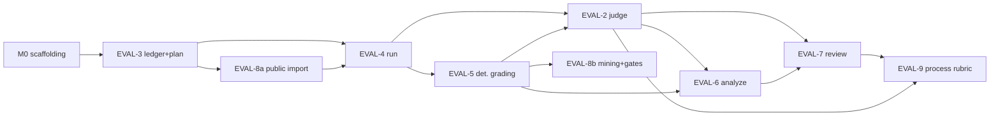

# 00 — verdi-bench Master Implementation Plan (EVAL-1)

**Handoff protocol:** EVAL-1 is an idea spec, not a buildable unit — `/build` consumes stories only. This document is the program-level plan: repo scaffolding (Milestone M0), build order, the decision-gate dashboard, and the shared conventions every story plan assumes. **Prepend this document to every Opus build session**, along with the story's own plan (`0N-EVAL-X-implementation-plan.md`), its spec (`EvalX.spec.md`), and its decisions ledger (`EvalX.decisions.ndjson`).

Provenance tagging inside these plans: requirements cite their source (`[AC-n]`, `[EVAL-X-Dnnn]`, `[EVAL-1 invariant]`). Engineering choices the plans add beyond the specs are tagged `[plan choice]` — Opus may revisit those with justification; it may not revisit cited requirements.

---

## 1. Program summary

verdi-bench is a benchmark-grade A/B evaluation instrument for agent stacks, models, and configurations: pre-registered experiments, repeated paired trials in hermetic containers, insulated arms, deterministic-first grading, an outcome-blind advisory LLM judge, blinded human review as the closing authority, paired-bootstrap analysis behind a pre-registration fence, versioned task corpora, and an openly-unblinded process-diagnostic tier. Every layer of automation earns trust through measurement (order-consistency, kappa, integrity rate, flake baselines), and every operation is a hash-chained ledger event.

## 2. Residence & runtime (binding, all resolved)

- **Repo:** `verdi-bench`, standalone instrument repo, sibling to verdi-go, never inside the Koalafi monorepo [EVAL-1-D001, RESOLVED]. Forcing argument: trial workspaces will *contain* monorepo state; an in-repo harness would ride inside its own subjects.
- **Package:** Python 3.12+, managed by `uv`, plain CLI entrypoint (`bench`), host-agnostic (Linux/macOS + Docker + provider keys).
- **Runtime:** host CLI orchestrating pinned Docker trial containers via the run-trial seam (Harbor engine behind it) [EVAL-1-D005]. Subject agents are pre-baked into trial images, never installed on the host.
- **Venue tiering:** local-only execution first, every local record stamped `ADVISORY`; `TRUSTED` arrives later as a CI-tier config cutover [EVAL-1-D006].
- **Three data lifecycles:** (1) the instrument (this repo, semver; version + git sha stamped into every ledger event); (2) experiment notebooks — a directory passed at invocation; team notebooks live in a **separate internal repo** [EVAL-1-D002]; (3) task corpora — public via the Harbor registry (cached locally), internal corpora written **only** to the declared Koalafi boundary path [EVAL-1 invariant; enforced structurally by EVAL-8 AC-5].
- **Cost governance:** every experiment declares a `cost_ceiling`; `run` refuses new trials past it and ledgers the stop [EVAL-1-D007; EVAL-3 AC-1 schema + EVAL-4 AC-7 enforcement].

## 3. Milestone M0 — repo scaffolding (build before EVAL-3)

Not a story; a half-day of substrate every story assumes. `[plan choice]` throughout unless cited.

1. `uv init`, `pyproject.toml`: Python 3.12+, package `verdi_bench`, console script `bench`. Pin direct deps: `pydantic>=2` (all schemas), `pyyaml`, `click` or `typer` (CLI), `numpy` (stats, EVAL-6), `jinja2` (renders, EVAL-6/7), `hypothesis` + `pytest` (dev). Add deps per story, always pinned.
2. Directory skeleton mirroring the touchpoint namespaces:
   ```
   harness/
     cli.py            # verb registry; stories add subcommands
     schema/           # EVAL-3
     ledger/           # EVAL-3
     plan/             # EVAL-3
     run/              # EVAL-4
     adapters/         # EVAL-4
     grade/            # EVAL-5 (plugins/ inside)
     judge/            # EVAL-2
     analyze/          # EVAL-6 (+ confounds.py touched by EVAL-2)
     review/           # EVAL-7
     process/          # EVAL-9
     corpus/           # EVAL-8
     blind/            # shared scrub/canary core (see §7.4)
   tests/
     fixtures/         # shared fixture builders (see §7.6)
   ```
   Note the spec touchpoints use `harness/...` paths; keep that literal package name so planned symbols resolve exactly as declared.
3. CI: `pytest` + `hypothesis`; `import-linter` contracts file (stories add contracts: Harbor confined to the seam [EVAL-4], no LLM-client imports in `harness/grade/` [EVAL-5 constraint], ledger writes only via `events.py` constructors [EVAL-3]).
4. Instrument identity helper: `harness/version.py` exposing `(semver, git_sha)` — consumed by every event constructor [EVAL-1 invariant: provenance on every artifact].
5. Test-naming convention enforced by a collection hook: AC-mapped tests are named `test_ac<N>_*` exactly as listed in specs, so AC coverage is recomputable mechanically [EVAL-2 spec convention, adopted program-wide].

## 4. Build order and dependency graph

Order is EVAL-1's decomposition [judgment in spec], with EVAL-8 split into an early and a late slice (the spec itself directs public import early, mining late):

| Seq | Story | Plan doc | Why here |
|---|---|---|---|
| 1 | **EVAL-3** | 01 | Schemas + ledger + plan lock: everything else writes into it. |
| 2 | **EVAL-4** | 02 | Run seam, adapters, hermetic trials — produces the artifacts everything grades. |
| 2a | **EVAL-8 slice A** (public import + stratify) | 07 §M1–M2 | Calibration corpus is needed alongside EVAL-4 to exercise real trials. |
| 3 | **EVAL-5** | 03 | Deterministic grading + flake baseline (baseline is also EVAL-8's admission prerequisite). |
| 4 | **EVAL-2** | 04 | Judge layer; spec-first, built once run/grade artifacts exist to consume. |
| 5 | **EVAL-6** | 05 | Analyze + the pre-registration fence. |
| 6 | **EVAL-7** | 06 | Human review packet; shares the blinding core with EVAL-2; feeds kappa. |
| 7 | **EVAL-8 slice B** (mining + curation gate) | 07 §M3–M5 | Internal benchmark growth after the instrument is proven. |
| 8 | **EVAL-9** | 08 | Process rubric; reuses EVAL-2's judge client and EVAL-7's reveal + kappa machinery. |



## 5. Decision-gate dashboard (as of 2026-07-02)

The `/build` gate for a story requires its local decision ledger clean **and** its declared `inherited_decisions` RESOLVED in the parent ledger. Current state:

| Story | Open decisions | Gate | Working assumption in the plan |
|---|---|---|---|
| EVAL-3 | D007 (power variance source), D008 (lock hardening) | **BLOCKED** — both audit items | Recommended options; both isolated behind seams (plan §M6, §M3) so a flip is config-sized |
| EVAL-4 | none | **CLEAR** | — |
| EVAL-5 | none | **CLEAR** | — |
| EVAL-2 | D006 (kappa threshold + min sample) | **BLOCKED** | 0.6 / 20, as config defaults only |
| EVAL-6 | D004 (CI method by coverage) | **BLOCKED** | Coverage-selected via null-sim harness, behind a `CIMethod` seam |
| EVAL-7 | D003 (IPW kappa estimator) | **BLOCKED** | IPW (floor reweighted 1/0.2) + floor-only sensitivity, behind an estimator seam |
| EVAL-8 | none | **CLEAR** | — |
| EVAL-9 | D001–D004 (all four) | **BLOCKED** | All four recommendations; every one parameterized (plan §1) |
| EVAL-1 (idea) | D008 (A/A self-validation) | n/a — no child declares it inherited, so it blocks no child build | Treat as required-before-first-official-finding; machinery shared with EVAL-6-D004 (§7.7) |

**Handoff implication:** EVAL-4, EVAL-5, and EVAL-8 can go to Opus today. The others can be *implemented to the recommended option* if you accept the risk, but the plans structure each open decision behind a seam so resolution is a small diff, and each plan's §1 tells Opus exactly what is provisional. Formally, resolve the ledger items before calling those stories built.

## 6. Idea-level invariants → owning enforcement

Every invariant below is inherited by every child "by decree"; the idea spec marks them `enforced_by: review` until a child-owned test lands. This table is the allocation the story plans implement — when the listed test is green, update the idea spec's `enforced_by`.

| Invariant | Owning story / test |
|---|---|
| Arms insulated; agent never sees rubric/holdout content | EVAL-4 `test_ac9_holdout_canaries_absent`; EVAL-5 `test_ac1_holdouts_readonly` |
| Every stage fails closed; no operation without a ledger event | EVAL-3 `test_ac7_one_event_per_operation`; per-stage CANT_* tests (EVAL-2 AC-8, EVAL-5 AC-5, EVAL-9 AC-4) |
| Claims tagged [computed]/[judgment]; artifacts carry instrument provenance | EVAL-3 `test_ac6_event_provenance_stamped`; EVAL-6 `test_ac6_finding_provenance` |
| Orchestrator cannot write ledger / read holdouts pre-grade / emit unregistered official reports | EVAL-3 chain verify (tamper-EVIDENT v1 per EVAL-3-D002); EVAL-4 AC-9; EVAL-6 `test_ac5_unregistered_refused` |
| experiment.yaml sha-locked at plan; primary metric + decision rule immutable | EVAL-3 `test_ac2_mutation_refused` |
| Local = ADVISORY; TRUSTED requires CI tier | EVAL-4 `test_ac9_advisory_stamp` |
| Internal corpora never enter the instrument repo | EVAL-8 `test_ac5_boundary_enforced` |
| Cost ceiling declared and enforced | EVAL-3 `test_ac1_missing_cost_ceiling_rejected`; EVAL-4 `test_ac7_ceiling_stops` |

## 7. Shared conventions (all stories)

**7.1 Ledger events.** `harness/ledger/events.py` (EVAL-3) owns typed constructors — the *only* write path. Later stories extend it with their event types rather than serializing ad hoc: `trial`, `trial_infra_failed`, `run_stopped_cost_ceiling`, `grade`, `cant_grade`, `judge_verdict` (subsumes CANT_JUDGE via `winner`), `human_verdict`, `reveal`, `flake_baseline`, `curation_approval`, `process_score` (subsumes CANT_SCORE), `acknowledged_underpowered`, `experiment_locked` (genesis). Every constructor auto-stamps `{ts, actor, experiment_id, instrument: {version, git_sha}}` [EVAL-3 AC-6].

**7.2 Fail-closed pattern.** A stage attempt yields exactly one event: success event or `CANT_*(reason)` with a machine-readable reason enum. Exceptions escape only when the *ledger write itself* fails [EVAL-3 AC-7]. No silent retries anywhere — a re-run is a new ledgered trial [EVAL-4-D002].

**7.3 Fixed metric vocabulary.** `primary_metric ∈ {holdout_pass_rate, judge_preference, cost_per_task, wall_time}`; composites banned [EVAL-3-D006]. EVAL-9 process dimensions are schema-ineligible as primaries [EVAL-9 AC-6] — implement the vocabulary as a closed enum in one place (`harness/schema/`) that both EVAL-3 validation and EVAL-9's negative test import.

**7.4 One blinding codepath.** `[plan choice, satisfying an EVAL-7 constraint]` Core scrub + canary validation lives in `harness/blind/core.py`. `judge/packet.validate_identity_free` (EVAL-2), `review/scrub.blind_scrub` (EVAL-7) are thin wrappers, so the declared touchpoint symbols still exist while the EVAL-7 constraint "single blinding codepath to test" holds. The canary corpus (arm ids, agent/model name patterns, transcript markers, plus EVAL-4's secret-key patterns kept as a *separate* redaction list — secrets ≠ identity) is a shared fixture. EVAL-9's redaction-canary check reuses it.

**7.5 Determinism.** Seed recorded at plan [EVAL-3-D005]; interleave, review floor sampling, calibration-subset selection, and bootstrap resampling are all pure functions of `(seed, inputs)` and derive sub-seeds by namespaced hashing (`sha256(seed || purpose)`) `[plan choice]` so stages can't perturb each other's streams.

**7.6 Fixture strategy.** `tests/fixtures/` provides a builder that fabricates a complete miniature experiment (locked yaml, chained ledger, artifacts dir, trial records, grades, verdicts) so each story's fixture ACs compose instead of hand-rolling ledgers per test. Fault injection via dependency-injected clock/IO/provider clients.

**7.7 Null-simulation harness (build once, serve twice).** EVAL-6-D004 (CI method by empirical coverage) and EVAL-1-D008 (A/A null experiments + simulated-null coverage checks before the first official finding) need the same machinery: simulate null paired experiments at the experiment's N, check CI coverage / false-positive rate. Implement as `harness/analyze/nullsim.py` in EVAL-6 §M5; if EVAL-1-D008 resolves as recommended, wire `bench selfcheck` on top and make EVAL-6's official-render path additionally require a recorded selfcheck event `[plan choice — do not implement the hard requirement until D008 resolves]`.

**7.8 Cross-vendor telemetry honesty.** Unmeasurable telemetry is `null`, never estimated [EVAL-4-D004]; official cross-stack comparisons run only on fields both arms measured [EVAL-6 AC-7]; raw token counts never cross vendors [EVAL-6 constraint].

## 8. Program-wide out of scope (v1)

Panel judge aggregation (schema stubbed only); TRUSTED CI tier; OpenCode adapter (arrives with model-vs-model per EVAL-1-D003); non-code task graders/rubrics; dedicated-UID/container ledger ownership; sequential/interim analysis; multi-experiment meta-analysis; corpus difficulty taxonomy beyond a manifest attribute.

## 9. Definition of done for the idea

Every child shipped (its own gate green) and every §6 invariant row pointing at a green child-owned test instead of `review`. Before the **first official finding**: full-run calibration recorded [EVAL-8 AC-2] and — pending EVAL-1-D008 — the A/A + coverage selfcheck.
