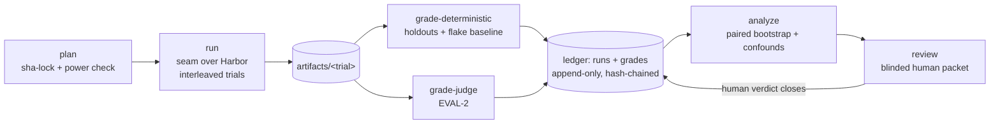

---
# ============================================================================
# IDEA SPEC (kind: idea) — groups child stories, owns what is SHARED:
# problem/goal, residence, cross-cutting invariants, idea-level decisions,
# and the decomposition. NEVER carries acceptance criteria or tests — a
# buildable idea spec is a story in a trench coat. /build consumes stories
# only. Child status is DERIVED from each child's own gate, never stored.
#
# YAML STYLE: string values double-quoted and single-line; block-style
# lists; no hanging-indent plain scalars; no >- / | folded blocks.
# ============================================================================
kind: "idea"
ticket: "EVAL-1"    # synthetic key — no Jira epic; source: design conversation 2026-07-02
title: "A/B evaluation harness for agent stacks, models, and configurations"
home:               # residence — inherited by every child unless a child overrides
  repo: "verdi-bench — standalone instrument repo, sibling to verdi-go, NOT the Koalafi monorepo (EVAL-1-D001)"
  package: "python 3.12+ managed by uv; plain CLI entrypoint, host-agnostic"
  runtime: "host CLI orchestrating pinned Docker trial containers via the run-trial seam (Harbor); subject agents pre-baked in trial images, never installed on the host"
  data: "operates on an experiments dir passed at invocation; the instrument repo never contains experiment data or internal task corpora"
​
children:           # status DERIVED per child (spec on main? decisions clean? built?)
  - "EVAL-2"        # judge layer — outcome-blind, configurable (spec DRAFTED)
  - "EVAL-3"        # schemas + append-only hash-chained ledger + plan stage: pre-registration lock, power/MDE check, opacity boundary (PROPOSED)
  - "EVAL-4"        # run stage: run-trial seam over Harbor, claude-code + codex adapters, telemetry normalization, hermetic pinned images, egress proxy (PROPOSED)
  - "EVAL-5"        # deterministic grading: holdout mounting, flake baselining, groundwork plugin hook for internal tasks (PROPOSED)
  - "EVAL-6"        # analyze: paired bootstrap CIs, effect sizes, confound flags, interleaving audit (PROPOSED)
  - "EVAL-7"        # human review packet: blinding scrub + measured integrity, verdict capture, kappa feed (PROPOSED)
  - "EVAL-8"        # task corpus tooling: public import (terminal-bench), mine-the-monorepo internal benchmark (PROPOSED)
  - "EVAL-9"        # transcript process rubric — openly-unblinded diagnostic tier (spec DRAFTED, from EVAL-2-D007)
​
constraints:        # idea-level INVARIANTS — inherited by every child by decree
  - text: "Arms are insulated from external input and from each other; the agent under test never sees rubric or holdout content."
    enforced_by: "review"   # → EVAL-4 / EVAL-5 tests once those stories land
  - text: "Every stage fails closed; an attempted operation without a ledger event is unrepresentable."
    enforced_by: "review"   # → EVAL-3 tests
  - text: "Every claim is tagged [computed] or [judgment]; every artifact carries provenance including instrument version + git sha."
    enforced_by: "review"   # → EVAL-3 tests
  - text: "The orchestrating agent cannot write the results ledger, read holdouts pre-grade, or emit official reports for unregistered analyses."
    enforced_by: "review"   # → EVAL-3 tests (process/UID boundary)
  - text: "experiment.yaml is sha-locked at plan; primary metric and decision rule are fixed before any data collection."
    enforced_by: "review"   # → EVAL-3 tests
  - text: "Local execution is stamped ADVISORY; TRUSTED requires the CI tier."
    enforced_by: "review"   # → EVAL-4 provenance tests
  - text: "Internal task corpora and experiment artifacts never enter the instrument repo; proprietary tasks stay inside the Koalafi boundary."
    enforced_by: "review"   # candidate repo-level CI check once the instrument repo exists
  - text: "Every experiment declares a cost ceiling; run refuses new trials past it and ledgers the stop."
    enforced_by: "review"   # → EVAL-3 schema test + EVAL-4 enforcement tests
​
decisions:
  - "EVAL-1-D001"   # residence + name: verdi-bench (RESOLVED, jyang)
  - "EVAL-1-D002"   # notebooks: separate internal repo (RESOLVED, jyang)
  - "EVAL-1-D003"   # first comparison type: stack-vs-stack (RESOLVED, jyang)
  - "EVAL-1-D004"   # corpus strategy: both, public-first (RESOLVED, jyang)
  - "EVAL-1-D005"   # runner: harbor behind run-trial seam (RESOLVED, jyang)
  - "EVAL-1-D006"   # venue: local-only ADVISORY first (RESOLVED, jyang)
  - "EVAL-1-D007"   # cost governance: hard ceiling enforced by run (RESOLVED, jyang)
  - "EVAL-1-D008"   # self-validation: A/A + CI coverage (OPEN, audit 2026-07-02)
open_decisions:
  - "EVAL-1-D008"
​
policy_proposals: []
predicted_reach: null    # n/a — idea specs are not buildable units
expected_verify: "n/a — idea specs have no gate of their own; done = every child shipped and every idea-level invariant held by a child-owned test or policy."
---
​
# EVAL-1 — A/B evaluation harness for agent stacks, models, and configurations
​
## Problem & context
​
AI-enablement decisions (models, tools, MCP servers, CLAUDE.md directives,
workflows) are currently made on anecdote. A single A run vs a single B run
is noise: agentic trajectories are stochastic, provider behavior drifts over
hours, and a helpful orchestrator rerunning until results look good is a
silent p-hacking machine. Defensible recommendations need a benchmark-grade
instrument: pre-registered experiments, repeated paired trials, insulated
arms, deterministic-first grading, a debiased advisory judge, and a human
verdict rendered from sufficient evidence.
​
## Goal
​
A portable, platform-agnostic instrument that runs controlled A/B
experiments over real agent stacks (Claude Code, Codex, OpenCode) and any
models, producing findings that survive hostile review: pre-registered,
powered, paired, provenance-stamped end to end, with the human as final
judge and every layer of automation earning its trust through measurement.
​
## Residence & runtime
​
The harness is an **instrument**, and instruments do not live inside what
they measure. Standalone repository — sibling to verdi-go; **verdi-bench** [EVAL-1-D001] — as a Python 3.12+/uv package exposing a plain CLI. The
forcing argument is workflow testing: trial workspaces will *contain*
Koalafi monorepo state, so an in-repo harness would ride along inside its
own subjects, entangling instrument version with subject version. Standalone
residence gives independent semver; harness version + git sha is stamped
into every ledger event — the instrument-identity analog of
flowmap_version in graph provenance.
​
Runtime: host-agnostic CLI on any Linux/macOS host with Docker and provider
API keys — laptop, devcontainer, later CI. Trial containers are pre-baked
pinned images with subject agents installed (no network pulls at trial
time); the host requires no coding agent. The opacity invariant rides on
this process boundary: an orchestrating AI may invoke the CLI but the
harness runs as its own process writing an append-only ledger the
orchestrator cannot reach into.
​
Three data lifecycles: the **instrument** (this repo, semver); **experiment
notebooks** (definitions, runs, artifacts, verdicts — a directory passed at
invocation; personal dir, or a separate internal experiments repo for team use [EVAL-1-D002]); **task corpora** (public via the Harbor registry; internal
mined-from-monorepo tasks stay inside the boundary — forced by IP, and it
preserves their contamination-free property).
​
## Architecture
​
Six stages, files as the API between them, each a least-privilege process:
​

​
> Provenance: [judgment] hand-authored — greenfield, no graph tooling.
​
Determinism lives out-of-band (holdouts, telemetry, stats); judgment lives
in the judge layer and the human, each earning weight through measurement
(order-consistency, kappa). Runner is Harbor behind the run-trial seam
[EVAL-1-D005] — swappable for thin-custom without touching the science
layer. Local execution stamps ADVISORY; the TRUSTED CI tier is a later
config-only cutover [EVAL-1-D006], mirroring fetch-graph's provenance
tiering.
​
## Decomposition
​
Story sizing rule: one story = one buildable unit with its own ACs, tests,
and ledger; if a story's AC list stops fitting on a screen, it is two
stories. Build order [judgment]:
​
1. **EVAL-3** first — schemas, ledger, plan stage, opacity boundary:
   everything else writes into it.
2. **EVAL-4** run stage — seam, adapters, hermetic images, telemetry.
3. **EVAL-5** deterministic grading — holdouts + flake baselining.
4. **EVAL-2** judge — spec already drafted; builds after 4/5 exist to
   consume their artifacts (spec-first is the point).
5. **EVAL-6** analyze, **EVAL-7** review packet.
6. **EVAL-8** corpus tooling — public import early (calibration needs it
   alongside EVAL-4), monorepo mining after the instrument is proven.
7. **EVAL-9** process rubric — after EVAL-2 and EVAL-7, whose judge
   client, reveal event, and kappa machinery it reuses.
​
Each child gets its own /design run with `parent: EVAL-1` and declares the
parent decisions it depends on via `inherited_decisions:`; the /build gate
for a child requires its own ledger clean AND its declared inherited ids
RESOLVED here (gate v2 — foreign ids resolve by ticket prefix).
​
## Open questions
​
- EVAL-1-D008 — self-validation protocol (A/A null experiments + CI-coverage
  check) required before the first official finding [audit 2026-07-02].
​
Idea-level opens block only the children that declare them inherited;
they do not gate children that don't.