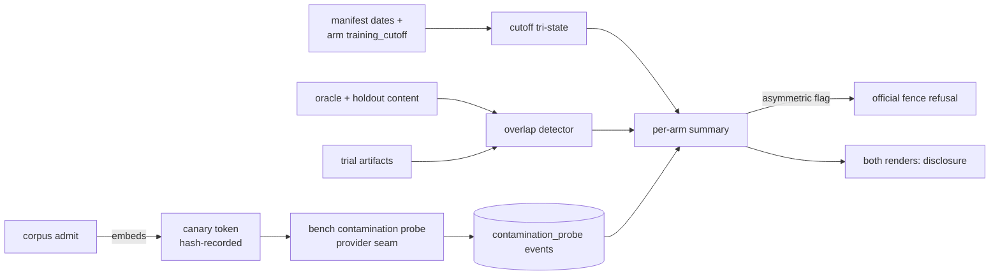

---
# MACHINE CONTRACT — see template header for consumers and YAML style rules.
# STATUS: PROPOSED (2026-07-04). Lives under specs/proposed/ so the AC-coverage
# hook does not enforce it before build; graduates to specs/ in the same commit
# as the story's first AC tests, once its open decisions resolve.
kind: "story"
ticket: "EVAL-10"   # synthetic key — source: Phase-7 readiness assessment roadmap gap #2
parent: "EVAL-1"
title: "Contamination sentinel: training-set membership detection for tasks and solutions"
services: []
home: null          # inherited from EVAL-1 (verdi-bench)
inherited_decisions:
  - "EVAL-1-D001"   # instrument residence + name (RESOLVED: verdi-bench)
touchpoints:        # PLANNED symbols [judgment]
  - "harness/contamination/dating.py:cutoff_status"
  - "harness/contamination/canary.py:derive_canary"
  - "harness/contamination/overlap.py:solution_overlap"
  - "harness/contamination/probe.py:run_memory_probe"
  - "harness/cli.py:cmd_contamination_probe"

graph_provenance: []

acceptance:
  - id: "AC-1"
    text: "Cutoff dating: corpus manifest tasks carry created_at; the arm schema gains an optional training_cutoff; per (task, arm) a deterministic tri-state is computed — clean_by_date (task created after the arm model's cutoff), unknown (either date absent), flagged (a positive detection from AC-3/AC-4). Unknown is honest null, never coerced to clean."
    vc: "Tri-state fixtures cover all date combinations; an absent cutoff yields unknown, not clean; the computation is a pure function of manifest + spec."
    touchpoints:
      - "harness/contamination/dating.py:cutoff_status"
    tests:
      - "test_ac1_cutoff_tristate"
      - "test_ac1_unknown_never_clean"
  - id: "AC-2"
    text: "Canary embedding: internal tasks admitted via bench corpus admit gain a deterministic canary token (sub-hash of task_sha, no randomness) embedded as an inert marker in task content and recorded in the manifest by hash. Canary values never appear in rendered findings, review packets, or any published artifact — events and reports carry the hash only."
    vc: "Admission embeds the derived canary; a render/packet fixture containing a canary value fails the scrub property test; probe events store sha256(canary), never the value."
    touchpoints:
      - "harness/contamination/canary.py:derive_canary"
    tests:
      - "test_ac2_canary_deterministic_embed"
      - "test_ac2_canary_never_published"
  - id: "AC-3"
    text: "Memory probe: bench contamination probe runs prefix-completion probes per arm model (canary regurgitation; oracle-solution continuation) through the existing provider client seam, ledgers exactly one contamination_probe event per run with per-task tri-state outcomes, and fails closed to CANT_PROBE(reason) — never a silent partial probe."
    vc: "A fake-provider fixture that regurgitates a canary flags the task; a provider error yields CANT_PROBE with the reason enum; the one-event property sweep covers the verb."
    touchpoints:
      - "harness/contamination/probe.py:run_memory_probe"
      - "harness/cli.py:cmd_contamination_probe"
    tests:
      - "test_ac3_regurgitation_flags"
      - "test_ac3_cant_probe_fail_closed"
  - id: "AC-4"
    text: "Solution-overlap detector: a deterministic fingerprint comparison of each trial's solution artifacts against the task's oracle solution (when the corpus carries one) and against holdout content; overlap above the pre-registered threshold flags the trial; any holdout-content overlap additionally raises the EVAL-4 insulation alarm channel."
    vc: "Planted verbatim and near-verbatim solutions flag; independently-written solutions do not; holdout overlap raises HoldoutLeakError alongside the flag; output is byte-identical for fixed inputs."
    touchpoints:
      - "harness/contamination/overlap.py:solution_overlap"
    tests:
      - "test_ac4_overlap_flags_verbatim"
      - "test_ac4_holdout_overlap_alarms"
  - id: "AC-5"
    text: "Findings integration: both renders carry a per-arm contamination summary (counts by tri-state, flagged task ids); asymmetric flagged contamination (one arm's model flagged on a task, the other clean) refuses the official render via the fence; symmetric or unknown states render as a disclosed, non-suppressing caveat."
    vc: "Fence fixture with an asymmetric flag refuses official naming the task and arms; symmetric-flag and all-unknown fixtures render official with the caveat; exploratory always renders with the summary."
    touchpoints:
      - "harness/contamination/dating.py:cutoff_status"
    tests:
      - "test_ac5_asymmetry_refuses_official"
      - "test_ac5_symmetric_discloses"
  - id: "AC-6"
    text: "Import hygiene: the deterministic detectors (dating, canary derivation, overlap) import no LLM client — enforced by an import-linter contract; the probe module is the story's only LLM-touching module."
    vc: "The contract is kept in lint-imports; a planted provider import in overlap.py breaks it."
    touchpoints:
      - "harness/contamination/overlap.py:solution_overlap"
    tests:
      - "test_ac6_detectors_llm_free"

constraints:
  - text: "Canary values are secrets of the instrument: hash-only in events and reports, never in any published artifact — a leaked canary is evidentially dead."
    enforced_by: "test:test_ac2_canary_never_published"
  - text: "Memory probes never run inside trial containers or share context with judge calls — a probe must not contaminate the experiment it protects."
    enforced_by: "review"
  - text: "Overlap thresholds are pre-registered at plan lock, never tuned post-hoc against observed trials."
    enforced_by: "review"
  - text: "Unknown contamination status is disclosed as unknown; it never silently upgrades to clean or downgrades a finding."
    enforced_by: "test:test_ac1_unknown_never_clean"

decisions:
  - "EVAL-10-D001"  # asymmetric-contamination disposition (OPEN)
  - "EVAL-10-D002"  # v1 probe technique set (OPEN)
  - "EVAL-10-D003"  # overlap metric + threshold locking (OPEN)
  - "EVAL-10-D004"  # flagged-task corpus lifecycle (OPEN)
open_decisions:
  - "EVAL-10-D001"
  - "EVAL-10-D002"
  - "EVAL-10-D003"
  - "EVAL-10-D004"

policy_proposals: []
predicted_reach: null
expected_verify: "n/a for groundwork; mechanical gate analog: AC suite green including the asymmetry fence and canary-scrub property tests."
---

# EVAL-10 — Contamination sentinel

## Problem & context

The paired A/B design controls harness and ordering confounds, but not
memorization: if an arm's model saw a task — or its oracle solution — in
training, its measured "capability" is recall, and the comparison is
invalid in the worst way: asymmetrically. EVAL-8 curation controls
provenance *into* the corpus; nothing today asks whether content leaked
*out* into a training set. For an instrument whose credibility is the
product, this is the most conspicuous absence on the roadmap
(Phase-7 readiness assessment, roadmap gap #2).

## Goal

Three independent detection channels — dating, planted canaries, and
solution overlap — each honest about what it can and cannot prove,
feeding a per-arm contamination summary that every render discloses and
that the official fence acts on when contamination is *asymmetric*
between arms (the case that breaks A/B validity).

## Residence & runtime

Inherited from EVAL-1; this story owns `harness/contamination/`. Builds
after EVAL-8 (manifest, admission hook) and EVAL-6 (fence, confound
rendering); the probe reuses EVAL-2's provider client seam. Independent
of EVAL-11/EVAL-12.

## Design

**Dating (deterministic, strongest when it applies)** [AC-1]. A task
created after every arm model's training cutoff cannot be contaminated.
Tri-state per (task, arm); `unknown` is a first-class honest state per
the §7.8 cross-vendor honesty rule — a missing cutoff date must never
launder into "clean".

**Canaries (proof of membership)** [AC-2, AC-3]. Internal tasks carry a
deterministic canary token (derived from `task_sha` by namespaced
sub-hash — no randomness, per §7.5). A model that completes the canary
*without it in context* has seen the task in training: near-zero false
positive rate. The evidentiary value dies if the canary leaks through
any published surface, so values are hash-only everywhere outside task
content itself. Note this is a *different* canary corpus from the
blinding canaries (§7.4): those detect identity/holdout leakage into
packets; these detect training-set membership. Separate lists, separate
purposes, one shared scrub mechanism.

**Overlap (post-hoc, per trial)** [AC-4]. Deterministic fingerprint
overlap between what the agent produced and what it could not have
independently produced — the oracle solution and the holdout content.
Holdout overlap doubles as an insulation alarm (the agent should never
have seen it at all, EVAL-4 AC-9).

**Disposition** [AC-5, D001]. Symmetric contamination degrades both arms
equally and is disclosed; *asymmetric flagged* contamination invalidates
the pairing and refuses the official render (exploratory still renders,
watermarked, with the summary). Flags never silently delete trials —
disclosure over suppression, matching the EVAL-6 confound posture.

## Change surface

> Provenance: [judgment] hand-authored — greenfield.

## Acceptance criteria mapping

AC-1 makes the cheap, deterministic channel honest about unknowns. AC-2
plants evidence that cannot false-positive and protects its evidentiary
value. AC-3 turns membership into a ledgered, fail-closed measurement.
AC-4 catches recall in the trials themselves and doubles as an
insulation tripwire. AC-5 routes the one validity-breaking case to the
fence and everything else to disclosure. AC-6 keeps the deterministic
tier deterministic.

## Expected post-state

A fixture experiment with one post-cutoff task, one canary-flagged task,
and one overlap-flagged trial renders a per-arm contamination summary in
both renders; the asymmetric case refuses official; `bench contamination
probe` is registered in the one-event property sweep and the README.

## Out of scope

Logprob/perplexity membership inference (vendor-gated, v2 — see D002);
contamination *removal* or task rewriting; probing models not named as
arms; dataset-level dedup against public benchmark dumps.

## Open questions

- EVAL-10-D001 — asymmetric-flag disposition (recommended: refuse
  official).
- EVAL-10-D002 — v1 probe set (recommended: canary regurgitation +
  oracle-prefix continuation; no logprobs).
- EVAL-10-D003 — overlap metric (recommended: winnowing fingerprints;
  threshold locked at plan).
- EVAL-10-D004 — flagged-task corpus lifecycle (recommended: disclose +
  ledgered operator quarantine reusing flake-quarantine mechanics; no
  auto-removal).
