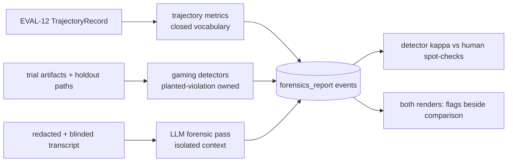

---
# MACHINE CONTRACT — see template header for consumers and YAML style rules.
# Graduated from specs/proposed/ 2026-07-04 in the same commit as the story's
# first AC tests; D001–D004 resolved in the decision session, D005–D007 raised
# and resolved in the build session (see eval11.decisions.ndjson).
kind: "story"
ticket: "EVAL-11"   # synthetic key — source: Phase-7 readiness assessment roadmap gap #1
parent: "EVAL-1"
title: "Transcript forensics: deterministic trajectory metrics, gaming detectors, and a blinded advisory review pass"
services: []
home: null          # inherited from EVAL-1 (verdi-bench)
inherited_decisions:
  - "EVAL-1-D001"   # instrument residence + name (RESOLVED: verdi-bench)
touchpoints:        # PLANNED symbols [judgment]
  - "harness/forensics/metrics.py:trajectory_metrics"
  - "harness/forensics/detectors.py:run_detectors"
  - "harness/forensics/review.py:forensic_review"
  - "harness/forensics/cli.py:register"   # realized as the repo-standard sub-typer

graph_provenance: []

acceptance:
  - id: "AC-1"
    text: "Trajectory metrics are a closed, versioned vocabulary computed as a pure function of the EVAL-12 TrajectoryRecord — step and tool-call counts and distribution, edit/test loop cadence, re-edit (thrash) rate, time-to-first-test, error-recovery latency, destructive-command count — with the vocabulary version stamped into every forensics_report event; unmeasurable inputs yield null metrics, never estimates."
    vc: "Fixed trajectory fixtures yield byte-identical metric payloads; a record missing a field nulls the dependent metrics; changing the vocabulary bumps the version."
    touchpoints:
      - "harness/forensics/metrics.py:trajectory_metrics"
    tests:
      - "test_ac1_metrics_deterministic"
      - "test_ac1_versioned_vocabulary"
  - id: "AC-2"
    text: "Gaming detectors — holdout-tamper attempt (edits or deletions targeting holdout/test paths), hardcoded-expected-output (solution literals matching holdout assertion values), test-skip insertion, and suspicious single-step completion — each ship with a planted-violation fixture that must flag and a clean fixture that must not."
    vc: "Every detector's planted transcript flags with the named detector id; the clean corpus produces zero flags; detector ids are a closed enum."
    touchpoints:
      - "harness/forensics/detectors.py:run_detectors"
    tests:
      - "test_ac2_planted_violations_flag"
      - "test_ac2_clean_corpus_silent"
  - id: "AC-3"
    text: "The deterministic tier (metrics + detectors) imports no LLM client — enforced by an import-linter contract mirroring the EVAL-5 grading constraint."
    vc: "The contract is kept in lint-imports; a planted provider import in detectors.py breaks it."
    touchpoints:
      - "harness/forensics/detectors.py:run_detectors"
    tests:
      - "test_ac3_deterministic_tier_llm_free"
  - id: "AC-4"
    text: "The advisory LLM forensic pass reviews identity-scrubbed transcripts (EVAL-4/EVAL-7 blind core) in a model call sharing no context with outcome-judge or process-rubric calls, fails closed to CANT_REVIEW(reason), tags every narrative claim [judgment], and is calibrated against human spot-checks on the EVAL-7 reviewed sample using the existing kappa machinery."
    vc: "Blinding canaries never reach the forensic payload (property test); the call-isolation property test passes; a provider failure yields CANT_REVIEW; calibration fixtures produce a per-detector kappa."
    touchpoints:
      - "harness/forensics/review.py:forensic_review"
    tests:
      - "test_ac4_blinded_isolated_call"
      - "test_ac4_cant_review_fail_closed"
  - id: "AC-5"
    text: "Findings integration: forensic flags and metric summaries render beside their comparison in both renders as non-suppressing disclosures; forensic outputs are schema-ineligible as primary metrics (the EVAL-3 closed vocabulary is unchanged)."
    vc: "Registering a forensic metric as primary_metric fails schema validation; render fixtures show flags beside the affected comparison in official and exploratory outputs."
    touchpoints:
      - "harness/forensics/metrics.py:trajectory_metrics"
    tests:
      - "test_ac5_primary_ineligible"
      - "test_ac5_flags_render_beside_comparison"
  - id: "AC-6"
    text: "Coverage honesty: the forensics report states exactly which trials lack forensic coverage and why (no trajectory record, corrupt record) — partial coverage is disclosed, never silent."
    vc: "A fixture with one trajectory-less trial renders the gap with the trial id and reason; a full-coverage fixture renders no gap line."
    touchpoints:
      - "harness/cli.py:cmd_forensics"
    tests:
      - "test_ac6_partial_coverage_disclosed"

constraints:
  - text: "Forensic flags are evidence, never verdicts: no flag auto-fails a trial or auto-changes a grade; disposition beyond disclosure requires a ledgered operator action."
    enforced_by: "test:test_ac5_flags_render_beside_comparison"
  - text: "The deterministic tier imports no LLM client."
    enforced_by: "test:test_ac3_deterministic_tier_llm_free"
  - text: "The LLM forensic pass sees transcripts only post-redaction and post-blinding, and shares no context with outcome or process-rubric judge calls."
    enforced_by: "test:test_ac4_blinded_isolated_call"
  - text: "Detector vocabulary is closed and versioned; adding a detector bumps the version — findings from different vocabulary versions are never merged silently."
    enforced_by: "test:test_ac1_versioned_vocabulary"

decisions:
  - "EVAL-11-D001"  # v1 metric + detector set (RESOLVED: proposed-set)
  - "EVAL-11-D002"  # LLM forensic pass in v1 (RESOLVED: in-v1)
  - "EVAL-11-D003"  # flag disposition (RESOLVED: disclose-plus-operator-path)
  - "EVAL-11-D004"  # fence coupling (RESOLVED: disclosure-only-v1)
  - "EVAL-11-D005"  # trajectory command field (RESOLVED: extend-step-command, ContractChange)
  - "EVAL-11-D006"  # human spot-check ingestion (RESOLVED: forensics-record-verb)
  - "EVAL-11-D007"  # quarantine semantics (RESOLVED: exclude-and-disclose)
open_decisions: []

policy_proposals: []
predicted_reach: null
expected_verify: "n/a for groundwork; mechanical gate analog: AC suite green including every planted-violation detector fixture."
---

# EVAL-11 — Transcript forensics

## Problem & context

Outcome grades say an agent passed; they cannot say it passed *honestly*
or *efficiently*. The field's own evidence (HAL's automated log
inspection) shows agents shortcut and game benchmarks in ways outcome
scores miss — deleting tests, hardcoding expected values, skipping the
work. verdi-bench ledgers every artifact but never reads the trajectory.
This story adds the reading — deterministic-first, in the house style
(Phase-7 readiness assessment, roadmap gap #1).

## Goal

Every trial gets a mechanical trajectory profile and a gaming scan whose
detectors are proven against planted violations; an optional blinded
advisory LLM pass narrates *why* a trajectory looks the way it does,
earning weight the same way every other judge in this instrument does —
through calibration. Nothing in this tier can move a primary metric.

## Residence & runtime

Inherited from EVAL-1; this story owns `harness/forensics/`. Builds
after EVAL-12 slice A (the TrajectoryRecord it consumes) and reuses the
EVAL-4/7 blind core, the EVAL-2 provider client, and the EVAL-7 kappa
machinery. EVAL-12 slice B (the dossier) renders its outputs.

## Design

**Deterministic tier** [AC-1, AC-2, AC-3]. Pure functions of the
trajectory record and trial artifacts; no LLM imports (contract). The
gaming detectors are the load-bearing novelty, and each one is owned the
way this repo owns everything: a planted violation that must flag and a
clean fixture that must not [AC-2]. Metric nulls follow §7.8 honesty —
an adapter that cannot measure tool calls yields null, not zero.

**Advisory tier** [AC-4, D002]. The LLM pass mirrors EVAL-9's firewall
pattern: blinded input, isolated context, fail-closed, [judgment] tags,
kappa calibration on the human-reviewed sample. It answers "does this
trajectory show shortcut behavior a regex cannot name" — and its
verdicts are advisory narrative beside the mechanical flags, never a
substitute for them.

**Disposition** [AC-5, AC-6, D003, D004]. Flags disclose beside the
comparison they affect, in both renders, non-suppressing — the confound
posture. A confirmed-gaming trial is an operator decision (ledgered
quarantine path), not an automatic one: a detector wrong in the
fail-closed direction would silently bias the instrument it protects.
Fence coupling is deliberately deferred to a decision (D004) until
calibration data exists.

## Change surface

> Provenance: [judgment] hand-authored — greenfield.

## Acceptance criteria mapping

AC-1 makes the profile deterministic and versioned. AC-2 makes every
detector earn its existence against a planted violation. AC-3 keeps the
mechanical tier mechanical. AC-4 contains the LLM pass with the same
firewalls every other judge lives under. AC-5 keeps forensics out of
primary claims while making it impossible to miss. AC-6 forbids silent
partial coverage.

## Expected post-state

A fixture experiment with one planted holdout-tamper trial and one
hardcoded-output trial renders both flags beside their comparisons; the
forensic kappa table appears in the exploratory render; `bench
forensics` registers in the one-event property sweep and the README.

## Out of scope

Auto-failing or regrading flagged trials (permanently, by constraint);
trajectory-based training or steering of agents; cross-experiment
forensic trend analysis (v2, enabled by the ledger); real-time
in-trial monitoring.

## Open questions

- EVAL-11-D001 — v1 metric and detector set (recommended: the proposed
  six metrics + four detectors).
- EVAL-11-D002 — LLM forensic pass in v1 (recommended: in, reusing
  EVAL-9's isolation pattern) or deferred to a follow-up slice.
- EVAL-11-D003 — flag disposition (recommended: disclose-only plus a
  ledgered operator quarantine path; never auto-fail).
- EVAL-11-D004 — fence coupling (recommended: none in v1; revisit with
  calibration data — a detector must prove its precision before it can
  block an official finding).
