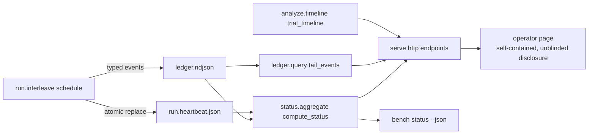

---
# MACHINE CONTRACT — see template header for consumers and YAML style rules.
# Graduated 2026-07-04 in the same commit as the story's first AC tests, all
# four local decisions resolved (see eval13.decisions.ndjson).
kind: "story"
ticket: "EVAL-13"   # synthetic key — source: 2026-07-04 observability directive (session)
parent: "EVAL-1"
title: "Live observability: run heartbeat, ledger tail cursor, status aggregate, and a read-only operator dashboard"
services: []
home: null          # inherited from EVAL-1 (verdi-bench)
inherited_decisions:
  - "EVAL-1-D001"   # instrument residence + name (RESOLVED: verdi-bench)
touchpoints:        # PLANNED symbols [judgment]
  - "harness/run/heartbeat.py:RunHeartbeat"
  - "harness/ledger/query.py:tail_events"
  - "harness/status/aggregate.py:compute_status"
  - "harness/serve/server.py:make_server"
  - "harness/serve/page.py:OPERATOR_PAGE"

graph_provenance: []

acceptance:
  - id: "AC-1"
    text: "During bench run the scheduler maintains an operational heartbeat sidecar (run.heartbeat.json in the experiment dir): every write is a whole-document atomic replace (a reader can never observe a torn file), timestamps flow through the EventContext clock seam (injectable, deterministic in tests), the document carries {schema_version, experiment_id, state, ts, pid, cells{planned, done, infra_failures}, spend{accumulated, ceiling}, in_flight}, the in-flight cell (task, arm, repetition, trial_id, attempt, started_ts) is visible while a trial executes and null between trials, and the terminal state is finished or stopped_cost_ceiling. The heartbeat is telemetry, not evidence: it is never ledgered, never hash-chained, and its absence is tolerated by every reader."
    vc: "A fake-engine schedule leaves a finished heartbeat whose cells/spend match the ledger's trial events and whose ts values came from the injected clock; an engine wrapper that reads the sidecar mid-run observes state=running with the executing cell in_flight; a ceiling-stopped run leaves state=stopped_cost_ceiling; no new ledger event kinds are emitted."
    touchpoints:
      - "harness/run/heartbeat.py:RunHeartbeat"
      - "harness/run/interleave.py:schedule"
    tests:
      - "test_ac1_heartbeat_lifecycle_and_clock_seam"
      - "test_ac1_heartbeat_in_flight_visible_mid_trial"
      - "test_ac1_heartbeat_ceiling_stop_state"
  - id: "AC-2"
    text: "The ledger read seam gains an incremental tail cursor: tail_events(path, offset) parses only complete newline-terminated lines from the byte offset, returns (events, next_offset), leaves a partial tail line unconsumed for the next call, and refuses loudly (no silent empty result) when offset exceeds the file size — a shrunken ledger is evidence of rewriting, not a cursor reset. Polling from each returned next_offset yields every appended event exactly once."
    vc: "Interleaved append/tail rounds reconstruct the full event sequence with no loss or duplication; a torn final line is not consumed until its newline lands and the returned offset does not advance past it; offset > size raises a named error; absent file yields ([], 0)."
    touchpoints:
      - "harness/ledger/query.py:tail_events"
    tests:
      - "test_ac2_tail_cursor_no_loss_no_duplication"
      - "test_ac2_tail_leaves_partial_line_unconsumed"
  - id: "AC-3"
    text: "compute_status(experiment_dir) is a pure lifecycle read: it appends no ledger event and mutates nothing, and returns a versioned snapshot {schema_version, experiment_id, chain{ok, detail, head_hash, events}, lock, cells{planned, done, infra_failures}, per_arm outcome counts, spend vs ceiling with stopped_cost_ceiling, grade{graded, cant_grade_terminal, pending}, judge{verdicts, cant_judge}, review{packets, human_verdicts, reveals}, process_scores, forensics{reports, latest flags/coverage}, quarantines, contamination_probes, analyze{selfcheck, renders}, heartbeat} consistent with a scripted fixture ledger. Planned cells derive from the locked seed's own enumerate/derive path; selfcheck state reuses the EVAL-6 classifier. A broken hash chain fails closed: chain.ok=false with the verifier's detail and every ledger-derived section withheld (stages=null) rather than reported from unverified content; the heartbeat, being operational, is still shown."
    vc: "A fixture ledger scripted through lock/trials/grades/verdicts/quarantine yields exactly the expected counts; the ledger file bytes are identical before and after compute_status; a tampered ledger yields chain.ok=false with stages withheld."
    touchpoints:
      - "harness/status/aggregate.py:compute_status"
    tests:
      - "test_ac3_status_snapshot_from_fixture_ledger"
      - "test_ac3_status_is_pure_read"
      - "test_ac3_status_broken_chain_fails_closed"
  - id: "AC-4"
    text: "bench status <experiment-dir> is a registered read-only verb: --json emits the compute_status snapshot as JSON on stdout (machine-parseable, schema_version stamped), the default render is a human summary of the same snapshot, no ledger event is appended, and the README Usage block documents the verb (the XC-7 consistency test covers it mechanically)."
    vc: "Invoking the verb on a fixture experiment exits 0, --json output round-trips through json.loads to the compute_status snapshot, and the ledger is byte-identical before and after."
    touchpoints:
      - "harness/status/cli.py:register"
    tests:
      - "test_ac4_status_verb_json_and_readonly"
  - id: "AC-5"
    text: "bench serve <experiment-dir> hosts a loopback-default, read-only HTTP observer: GET /api/status returns the compute_status snapshot, GET /api/events?offset=N returns the tail cursor page {events, next_offset}, GET /api/timeline returns the EVAL-12 trial_timeline, unknown paths get 404, non-GET methods get 405, and serving mutates nothing — no ledger event, no file created or modified in the experiment dir."
    vc: "A threaded server over a fixture experiment answers all three endpoints with the same values the underlying seams return; POST/PUT/DELETE are refused 405 and unknown paths 404; a recursive before/after scan of the experiment dir shows identical bytes."
    touchpoints:
      - "harness/serve/server.py:make_server"
    tests:
      - "test_ac5_serve_endpoints_read_only"
      - "test_ac5_serve_refuses_non_get_and_unknown_paths"
  - id: "AC-6"
    text: "GET / returns the operator dashboard as one self-contained HTML document: no external URI schemes, no fetched assets, no href/src/link/@import/url() references — inline CSS and inline script only, polling exclusively same-origin relative /api/ paths — and the page carries the standing unblinded-operator disclosure: arm identities are visible by design, and a person who watches the live view is thereby disqualified from serving as an EVAL-7 blinded reviewer for this experiment. Legibility must not silently erode the blinding posture the review tier relies on."
    vc: "The served page contains none of the external-reference needles (http://, https://, src=, href=, url(, @import, <link); its only network calls are relative fetch('/api/...') strings; the disclosure banner text names both the unblinded status and the reviewer disqualification."
    touchpoints:
      - "harness/serve/page.py:OPERATOR_PAGE"
    tests:
      - "test_ac6_operator_page_self_contained"
      - "test_ac6_operator_page_unblinded_disclosure"
  - id: "AC-7"
    text: "Observability is structurally read-only and LLM-free: harness.status and harness.serve are added to the ledger-writes-only-via-events and harbor-confined-to-seam source lists (and harness.run.heartbeat to the latter), a new import-linter contract forbids them the LLM client modules, neither registers an entrypoint (the one-event-per-operation sweep set is unchanged), and no new ledger event kind is introduced by this story."
    vc: "lint-imports is green with the extended source lists and the new contract; planting a judge-client import into harness.status breaks the new contract; the entrypoint registry and REGISTERED_EVENTS are unchanged by importing the new modules."
    touchpoints:
      - "harness/status/aggregate.py:compute_status"
      - "harness/serve/server.py:make_server"
    tests:
      - "test_ac7_observability_contracts_and_no_entrypoints"

constraints:
  - text: "The heartbeat is operational telemetry, never evidence: it lives outside the hash chain, is never read by any gating stage, and no reader may refuse an experiment over its absence — the run.config.yaml precedent, not the ledger-event precedent. This story introduces zero hash-chained format changes."
    enforced_by: "test:test_ac1_heartbeat_lifecycle_and_clock_seam"
  - text: "The observer surface is GET-only and side-effect-free: no endpoint appends events, writes files, or triggers execution — a UI-triggered mutation path is a different story with its own actor and one-event obligations."
    enforced_by: "test:test_ac5_serve_endpoints_read_only"
  - text: "The live view is the openly-unblinded operator tier and must say so on every render, exactly as process scoring is openly unblinded [EVAL-9 precedent]: the disclosure names the EVAL-7 reviewer disqualification rather than pretending the view is blind."
    enforced_by: "test:test_ac6_operator_page_unblinded_disclosure"
  - text: "Status reads fail closed on a broken chain: ledger-derived sections are withheld, never rendered from unverified content [PL-6/CO-5 posture]."
    enforced_by: "test:test_ac3_status_broken_chain_fails_closed"

decisions:
  - "EVAL-13-D001"  # liveness channel (RESOLVED: heartbeat-sidecar, not a ledger event)
  - "EVAL-13-D002"  # server dependency (RESOLVED: stdlib-http-server, no new deps)
  - "EVAL-13-D003"  # UI blinding posture (RESOLVED: unblinded-operator-view-with-disclosure)
  - "EVAL-13-D004"  # transport (RESOLVED: client-polling, SSE deferred)
open_decisions: []

policy_proposals: []
predicted_reach: null
expected_verify: "n/a for groundwork; mechanical gate analog: AC suite green including the mid-trial in-flight observation, tail no-loss/no-dup property, pure-read byte-identity checks, and the planted-import contract break."
---

# EVAL-13 — Live observability: heartbeat, tail cursor, status, operator dashboard

## Problem & context

The instrument records everything and shows nothing while it happens: the
ledger is a durable per-trial feed (atomic, fsync'd appends), but `bench run`
is silent until its final summary line, nothing records that a trial *started*,
and no aggregate answers "where is this experiment in its lifecycle?" without
re-deriving it from raw events. The 2026-07-04 assessment found the read seams
excellent (pure `trial_timeline`, `selfcheck_status`, ledger `query`) and the
push/liveness/aggregation layer absent (session assessment, this directive).

## Goal

Watch an experiment live without weakening a single trust property: a
liveness heartbeat beside the ledger (never in it), an incremental tail
cursor on the read seam, one lifecycle snapshot function with a CLI verb, and
a loopback read-only dashboard that discloses its unblinded nature the way
every other openly-unblinded tier does.

## Residence & runtime

Inherited from EVAL-1. Two new subsystems own the new concerns:
`harness/status` (lifecycle aggregation, pure reads) and `harness/serve`
(HTTP presentation). The heartbeat writer lives in `harness/run` because the
scheduler owns execution; the tail cursor lives in `harness/ledger/query`
because incremental reading is a read-seam concern. Nothing new imports
`ledger.chain`, `run.engines.harbor`, or an LLM client — enforced by the
extended and new import-linter contracts [AC-7].

## Design

**Heartbeat** [AC-1, D001]. `schedule` maintains `run.heartbeat.json` via
atomic whole-document replace: state transitions running →
finished|stopped_cost_ceiling, the in-flight cell (with attempt number, so
infra re-runs are visible) between trial start and completion, and
counters consistent with the ledger. Timestamps ride the existing
EventContext clock seam. It is deliberately *not* a ledger event: liveness is
operational telemetry with no audit value once the trial event lands, and the
run verb's ledger footprint (N trial events + one executed_order) is a
versioned contract this story must not touch. A crash leaves a stale
`running` heartbeat; readers surface it verbatim and let the presentation
layer judge staleness — the harness never guesses.

**Tail cursor** [AC-2]. `append_event` writes each line in one syscall under
flock, so a byte-offset poller is torn-line-safe by construction; the cursor
makes that contract explicit at the read seam instead of leaving every
consumer to rediscover it. Refusing an offset beyond EOF keeps a rewritten
(shrunken) ledger loud at the observation layer, matching the chain's
tamper-evidence posture.

**Status** [AC-3, AC-4]. One pure function assembles the lifecycle snapshot
the assessment found missing: planned cells from the locked seed's own
`enumerate_trials`/`derive_schedule` (so "planned" is what run *will* run,
not a re-guess), done/pending from trial events, grade/judge/review/
forensics/analyze progress from their events, selfcheck state from the
EVAL-6 classifier, chain verdict from the read-side verifier. Broken chain ⇒
sections withheld, fail-closed. The verb is read-only and ledgers nothing.

**Serve + page** [AC-5, AC-6, D002–D004]. stdlib `http.server`, loopback by
default, three GET JSON endpoints wrapping the three seams, and one
self-contained page that polls them. The page inherits the dossier's
no-external-references property (inline script is allowed — it is a live
tool, not an archival artifact) and carries the unblinded-operator
disclosure on every render: watching the live view disqualifies you as this
experiment's blinded reviewer. Blinded/reviewer-safe views are a future
story; v1 refuses to pretend.

## Change surface

> Provenance: [judgment] hand-authored — greenfield.

## Acceptance criteria mapping

AC-1 gives liveness without touching the chain. AC-2 makes incremental
observation a contract, not a consumer trick. AC-3/AC-4 give one honest
lifecycle answer, fail-closed on tamper. AC-5 keeps the observer surface
side-effect-free. AC-6 keeps legibility from eroding blinding. AC-7 makes
read-only and LLM-free structural, not conventional.

## Expected post-state

`bench serve demo` on a running fake-engine experiment shows the in-flight
cell ticking through the interleave, per-arm counts and spend climbing as
trial events land, grade/judge/analyze chips advancing as those verbs run,
and a chain-OK badge — while `sha256(ledger.ndjson)` before and after any
amount of observing is unchanged, and a reviewer who never opened the page
remains eligible for the blinded packet.

## Out of scope

UI-triggered mutation (plan/run/grade from the browser — needs actor
plumbing and one-event obligations); reviewer-safe blinded views and the
review-capture UI; SSE/websocket push (polling suffices at serial-trial
cadence, D004); step-level mid-trial streaming (engine seam change);
multi-experiment registry/index; authentication (loopback operator tool).

## Open questions

None open — EVAL-13-D001..D004 resolved per eval13.decisions.ndjson
(2026-07-04 session directive accepting the assessment's recommendations).
