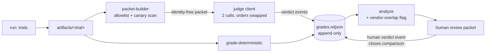

---
# ============================================================================
# MACHINE CONTRACT — consumed by /build (gate + context injection) and
# /mr-review (drift check + AC coverage recomputation). Fill every key;
# prefer null over omission. The prose body below is for humans.
#
# YAML STYLE: string values double-quoted and single-line; text/vc are one
# terse sentence (rationale lives in the body); block-style lists; no
# hanging-indent plain scalars.
#
# GREENFIELD ADAPTATION: fields assuming graph tooling are null with a
# reason; touchpoints are forward-declared planned symbols, not graph FQNs.
# ============================================================================
kind: "story"       # buildable unit; parent idea spec groups the harness stories
ticket: "EVAL-2"    # synthetic key — no Jira ticket; source: design conversation 2026-07-02
parent: "EVAL-1"    # idea: A/B evaluation harness
title: "Configurable, outcome-blind LLM judge layer for the A/B eval harness"
services: []        # greenfield — harness is not in verdi.yaml
home: null          # inherited from EVAL-1 (null = inherit; stories may override)
inherited_decisions:            # parent decisions this story depends on;
  - "EVAL-1-D001"   # instrument residence + repo name (RESOLVED: verdi-bench) — gate v2
                    # requires these RESOLVED in the parent ledger before /build
touchpoints:        # PLANNED symbols [judgment], not graph-derived FQNs
  - "harness/judge/packet.py:build_packet"
  - "harness/judge/packet.py:validate_identity_free"
  - "harness/judge/client.py:judge_pair"
  - "harness/judge/schema.py:Verdict"
  - "harness/judge/calibrate.py:kappa_by_class"
  - "harness/analyze/confounds.py:judge_vendor_overlap"
  - "harness/ledger/events.py:append_verdict"
 
graph_provenance: []   # n/a — no flowmap for this stack (greenfield)
 
acceptance:
  - id: "AC-1"
    text: "judge.model accepts any provider/model id; no code path restricts a judge by vendor, including arm vendors."
    vc: "An arm-vendor judge config validates, runs, and produces verdicts; no vendor allow/deny list exists in code."
    touchpoints:
      - "harness/judge/client.py:judge_pair"
    tests:
      - "test_ac1_judge_vendor_unrestricted"
  - id: "AC-2"
    text: "Judge packets are allowlist-built with exactly task prompt, workspace diff, holdout results, and rubric — no arm labels, model/agent names, transcripts, or telemetry."
    vc: "Canary property test: identity strings seeded in every non-allowlisted artifact field never appear in packets; a packet failing validation is never sent."
    touchpoints:
      - "harness/judge/packet.py:build_packet"
      - "harness/judge/packet.py:validate_identity_free"
    tests:
      - "test_ac2_packet_identity_free"
      - "test_ac2_packet_allowlist_only"
  - id: "AC-3"
    text: "Every comparison is judged in both presentation orders with randomized labels; order-inconsistent verdicts downgrade to TIE with order_inconsistent=true."
    vc: "Mocked cross-order disagreement records TIE plus flag; agreement records one verdict carrying both call ids."
    touchpoints:
      - "harness/judge/client.py:judge_pair"
    tests:
      - "test_ac3_order_debias_inconsistent_ties"
      - "test_ac3_both_orders_invoked"
  - id: "AC-4"
    text: "Verdicts are four-valued (A|B|TIE|CANT_JUDGE) and structurally require evidence citations; evidence-free verdicts are rejected and recorded as CANT_JUDGE(malformed)."
    vc: "Schema validation rejects evidence-free verdicts; the rejection itself appears in the ledger as a CANT_JUDGE event with reason=malformed."
    touchpoints:
      - "harness/judge/schema.py:Verdict"
    tests:
      - "test_ac4_evidence_required"
      - "test_ac4_malformed_becomes_cant_judge"
  - id: "AC-5"
    text: "Every verdict records full judge provenance (versioned model id, rubric sha256, packet sha256, call ids, orders, temperature, timestamps); alias model ids fail plan."
    vc: "Verdict events missing any provenance field fail schema; an experiment.yaml with an alias judge id fails the plan stage."
    touchpoints:
      - "harness/ledger/events.py:append_verdict"
    tests:
      - "test_ac5_verdict_provenance_complete"
      - "test_ac5_alias_model_id_rejected"
  - id: "AC-6"
    text: "Judge-vendor overlap with any arm vendor emits a judge_vendor_overlap confound flag in analyze output, the report, and the review packet header."
    vc: "Same-vendor configuration produces the flag; cross-vendor configuration produces none."
    touchpoints:
      - "harness/analyze/confounds.py:judge_vendor_overlap"
    tests:
      - "test_ac6_vendor_overlap_flagged"
      - "test_ac6_cross_vendor_clean"
  - id: "AC-7"
    text: "Judge-vs-human Cohen's kappa is computed per task class at the configured minimum sample; below-threshold classes are flagged for panel escalation; only human verdict events close comparisons."
    vc: "Fixture ledgers yield expected kappa; judge-only comparisons remain open in ledger state; below-threshold classes appear in the escalation table."
    touchpoints:
      - "harness/judge/calibrate.py:kappa_by_class"
      - "harness/ledger/events.py:append_verdict"
    tests:
      - "test_ac7_kappa_computation"
      - "test_ac7_human_verdict_closes"
      - "test_ac7_escalation_table"
  - id: "AC-8"
    text: "Judge invocation failures (timeout, refusal, provider error, parse failure) fail closed to CANT_JUDGE(reason); an attempted comparison without a verdict event is unrepresentable."
    vc: "Fault-injected judge calls each yield exactly one CANT_JUDGE event with a machine-readable reason."
    touchpoints:
      - "harness/judge/client.py:judge_pair"
    tests:
      - "test_ac8_fail_closed_timeout"
      - "test_ac8_fail_closed_refusal"
 
constraints:
  - text: "The judge never receives arm identity in any form; the packet builder is the sole path to the judge."
    enforced_by: "test:test_ac2_packet_identity_free"
  - text: "Judge verdicts are advisory; a comparison is closed only by a human verdict event in the ledger."
    enforced_by: "test:test_ac7_human_verdict_closes"
  - text: "Judge model ids must be fully versioned; aliases are rejected at plan time."
    enforced_by: "test:test_ac5_alias_model_id_rejected"
  - text: "Same-vendor judge configurations are legal and always disclosed."
    enforced_by: "test:test_ac6_vendor_overlap_flagged"
  - text: "The verdict ledger is append-only and hash-chained; judge and human verdicts share one schema family so kappa is computable."
    enforced_by: "review"   # bucket of last resort until the ledger subsystem spec lands with its own tests
 
decisions:
  - "EVAL-2-D001"   # configurable judge, mandatory disclosure (RESOLVED, jyang)
  - "EVAL-2-D002"   # outcomes-only visibility (RESOLVED, jyang)
  - "EVAL-2-D003"   # both-orders debiasing (RESOLVED, default accepted)
  - "EVAL-2-D004"   # human verdict finality (RESOLVED, from original brief)
  - "EVAL-2-D005"   # judge model: gemini, pinned at generation (RESOLVED, jyang)
  - "EVAL-2-D006"   # kappa threshold + min sample (OPEN)
  - "EVAL-2-D007"   # transcript rubric: include-in-v1 as EVAL-9 (RESOLVED, jyang)
  - "EVAL-2-D008"   # residence — RESOLVED: reparented to EVAL-1-D001 (idea-level concern)
open_decisions:
  - "EVAL-2-D006"
 
policy_proposals: []   # no groundwork policy surface for this stack; the packet-builder property tests are this subsystem's layer-0 equivalent
 
predicted_reach: null  # n/a — no call graph exists for greenfield code
expected_verify: "n/a for groundwork (no graph tooling for this stack); mechanical gate analog: the AC test suite above green, including the canary property tests."
---
# EVAL-2 — Configurable, outcome-blind LLM judge layer
 
## Problem & context
 
The A/B harness needs a layer-1 grader for outcomes that deterministic
holdouts cannot fully rank (two arms both pass; which solution is better?).
LLM-as-judge fills that gap but imports known biases: position bias,
verbosity bias, and self-preference. Prior design conversation resolved the
governing stance [EVAL-2-D001]: no code-level vendor restriction on the
judge — restriction is replaced by *disclosure* (a confound flag whenever
judge vendor overlaps an arm vendor) plus *empirical calibration* (kappa
against accumulating human verdicts). Rationale: outcome-blinding removes
explicit identity bias, but style-recognition partially survives blinding
[judgment: consistent with published LLM-judge findings]; a ban asserts the
bias, measurement demonstrates it — and configurability additionally enables
judge-bias experiments (multiple judges over identical trial sets).
 
## Goal
 
A judge subsystem where any model can be configured as judge, the judge
physically cannot learn which arm produced what it grades, every verdict is
evidence-cited and provenance-stamped, position bias is mechanically
cancelled, failures are fail-closed first-class outcomes, and the judge's
authority is earned through measured agreement with the human — who alone
closes comparisons [EVAL-2-D004].
 
## Residence & runtime
 
Inherited from the parent idea spec [EVAL-1 §Residence & runtime]:
standalone instrument repo (verdi-bench; EVAL-1-D001 resolved, declared inherited), host-agnostic uv/Python CLI over pinned Docker trial
containers, three-lifecycle data separation. This story adds no residence
overrides; the judge layer lives at `harness/judge/` within the instrument
repo.
 
## Design
 
### Position in the pipeline
 
The judge is stage 4 (`grade-judge`) of the six-stage harness. It consumes
per-trial artifacts produced by `run` and already graded by
`grade-deterministic`, and emits verdict events into `grades.ndjson`.
 
### Packet builder (the enforced invariant)
 
`build_packet(trial_a, trial_b, task, rubric)` constructs the judge input by
**allowlist**: task prompt, final workspace diff per response, holdout
results per response, rubric. Nothing else is reachable — transcripts,
telemetry, arm labels, agent/model names, and job paths encoding arm
identity are not inputs to the function. `validate_identity_free(packet)`
then scans for a canary set (arm ids, agent names, model id patterns,
transcript markers) seeded through test fixtures; a packet failing
validation is never sent [AC-2]. Response labels ("Response 1/2") are
assigned by a fixed both-orders scheme: every comparison is judged twice, once
in each order (AB and BA), and position bias is cancelled by construction — an
order-inconsistent verdict is downgraded to TIE [D003]. (This supersedes the
earlier "assigned randomly per call": because both orders always run, per-call
randomization removes no bias it does not already cancel and only adds a
nondeterministic surface, against determinism-by-default [EVAL-2-D-P6-3].)
Residual risk, disclosed not hidden: code style
tells inside the diff can survive scrubbing, same as human-packet blinding —
which is precisely why calibration (below) exists.
 
### Judge configuration [EVAL-2-D001]
 
```yaml
judge:
  model: <provider>/<fully-versioned-id>   # ANY provider; alias ids rejected at plan
  rubric: rubrics/code-task-v1.md
  orders: both                             # single allowed only for smoke runs; flagged
  temperature: 0
  panel: null                              # v2: {models: [...], aggregation: majority}
  escalation:
    kappa_threshold: <EVAL-2-D006>         # OPEN — recommended 0.6
    min_human_verdicts: <EVAL-2-D006>      # OPEN — recommended 20
```
 
Default judge id for the first stack-vs-stack experiment is OPEN
[EVAL-2-D005]; recommendation is the current pinned Gemini Pro (third party
to both Claude Code and Codex arms), but nothing in code depends on that
choice.
 
### Order debiasing [EVAL-2-D003]
 
Each comparison → two judge calls, orders swapped. Agreement → one verdict
recorded, both call ids attached. Disagreement → TIE with
`order_inconsistent: true` [AC-3]. Order-inconsistency *rate* is itself a
reported judge-quality metric [judgment: high rates indicate the rubric or
task class is under-determined].
 
### Verdict schema [AC-4, AC-5]
 
```json
{
  "event": "judge_verdict",
  "comparison_id": "…", "task_id": "…", "repetition": 3,
  "winner": "A|B|TIE|CANT_JUDGE",
  "reason": "…",
  "evidence": [
    {"kind": "diff", "response": 1, "hunk": "…"},
    {"kind": "holdout", "response": 2, "ref": "test_x::assert_y"}
  ],
  "confidence": "low|medium|high",
  "order_inconsistent": false,
  "provenance": {
    "judge_model": "<versioned id>",
    "rubric_sha256": "…", "packet_sha256": "…",
    "call_ids": ["…","…"], "orders": ["ab","ba"],
    "temperature": 0, "ts": "…"
  }
}
```
 
Evidence-free verdicts are schema-rejected and re-recorded as
CANT_JUDGE(malformed) — the rejection is an event, not an exception trace.
CANT_JUDGE with reason is a first-class outcome throughout (timeouts,
refusals, provider errors, unparseable output) [AC-8]; an attempted
comparison with no verdict event is unrepresentable.
 
### Vendor-overlap disclosure [AC-6]
 
`analyze` derives vendor from the model id prefix for judge and every arm.
Overlap → `judge_vendor_overlap` confound flag on the experiment, rendered
in the report header and the human review packet header. Legal, visible,
never silent.
 
### Calibration and escalation [AC-7, EVAL-2-D004]
 
Human verdicts (recorded through the review packet, schema-compatible with
judge verdicts) accumulate in the ledger. Per task class, once
`min_human_verdicts` is reached, Cohen's kappa between judge and human is
computed and reported. Classes below `kappa_threshold` are flagged for panel
escalation (v2 mechanism; v1 flags only). Judge authority is therefore
earned per class, mirroring the ADVISORY→TRUSTED provenance ladder. A
comparison's terminal state is set only by a `human_verdict` event.
 
### Emergent capability: judge-bias experiments
 
Because the judge is configuration, an experiment may declare multiple
judges over identical packets. Verdict deltas between judges — including an
arm-vendor judge vs a third-party judge — measure judge bias directly with
zero additional harness machinery [judgment].
 
## Change surface
 

 
> Provenance: [judgment] hand-authored — no static-analysis graph exists for
> greenfield code. This diagram is a claim about intended structure, not a
> computed fact; /mr-review's drift check does not apply until tooling
> exists for this stack.
 
## Acceptance criteria mapping
 
AC-1/AC-2 pin the governing pair: unrestricted judge choice, restricted
judge sight — the configuration freedom is only safe because the packet
invariant is test-enforced, so they ship together. AC-3/AC-4/AC-5 make each
verdict individually defensible (debiased, evidence-cited, provenance-
stamped). AC-6 makes the one disclosed risk of AC-1 impossible to hide.
AC-7 operationalizes "human is the final judge" as ledger state machine plus
the kappa loop that lets the judge earn weight. AC-8 extends the harness-
wide fail-closed posture into the judge: every attempted comparison yields
exactly one verdict event. Planned test names embed AC ids per the harness
convention so coverage is recomputable mechanically.
 
## Expected post-state
 
- Judge layer callable standalone: packets in, verdict events out; no other
  stage imports judge internals except through `grades.ndjson`.
- Canary property suite green — the identity-isolation invariant is proven,
  not asserted [computed: pytest, once built].
- Reports render: verdict distribution, order-inconsistency rate,
  vendor-overlap flag when applicable, kappa table (or "insufficient human
  verdicts" per class), escalation candidates.
- Gate analog: full AC suite green (see `expected_verify` note — no
  groundwork surface for this stack).
## Out of scope
 
- Panel aggregation implementation (config schema stubbed; flag-only in v1).
- Transcript/process rubric — resolved include-in-v1, implemented as the
  dedicated EVAL-9 story (openly-unblinded diagnostic tier); known
  identity-leaky; requires its own blinding analysis.
- Non-code task rubrics; CI TRUSTED execution tier; judge fine-tuning or
  few-shot calibration from human verdicts (interesting, later).
## Open questions
 
- EVAL-2-D006 — kappa threshold and minimum human-verdict sample per class.
(EVAL-2-D008 resolved by reparenting to EVAL-1-D001; it remains a gate
dependency via `inherited_decisions` — /build for this story requires it
RESOLVED in the parent ledger.)
 
This section must be empty before /build — the gate enforces it
(`record-decision.sh status --ticket EVAL-2` currently exits 1).