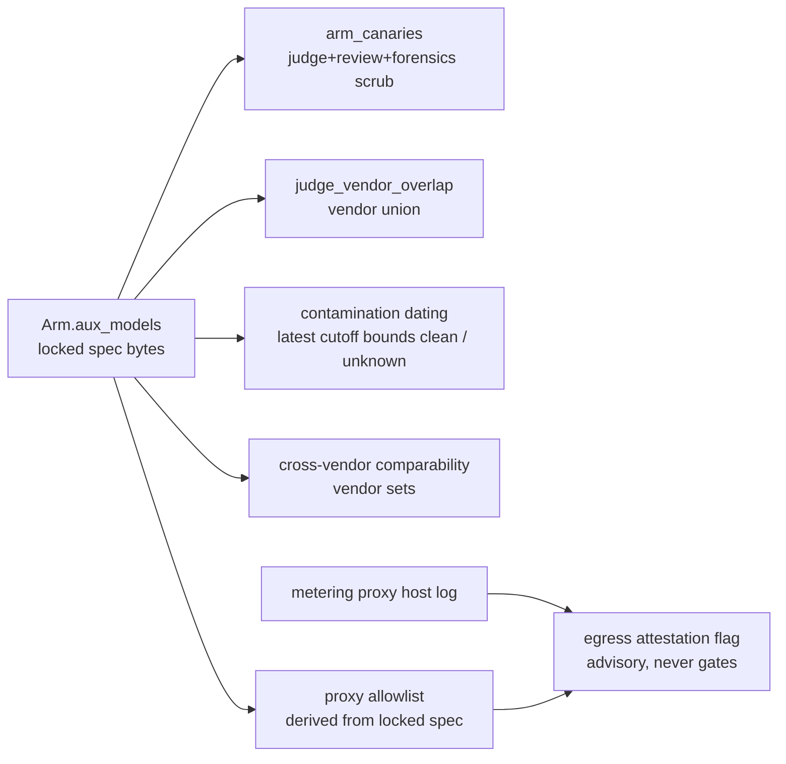

---
# MACHINE CONTRACT — see template header for consumers and YAML style rules.
# Graduated from specs/proposed/ 2026-07-04 in the same commit as the story's
# first AC tests, all five decisions resolved (see eval20.decisions.ndjson).
kind: "story"
ticket: "EVAL-20"   # synthetic key — source: 2026-07-04 multi-model workflow directive (session)
parent: "EVAL-1"
title: "Pre-registered multi-model arms: declared aux models feed blinding, confounds, contamination, and comparability"
services: []
home: null          # inherited from EVAL-1 (verdi-bench)
inherited_decisions:
  - "EVAL-1-D001"   # instrument residence + name (RESOLVED: verdi-bench)
  - "EVAL-4-D004"   # nulls flagged, never imputed
  - "EVAL-2-D001"   # no vendor allow/deny list
touchpoints:        # PLANNED symbols [judgment]
  - "harness/schema/experiment.py:Arm"
  - "harness/blind/core.py:arm_canaries"
  - "harness/analyze/confounds.py:judge_vendor_overlap"
  - "harness/contamination/summary.py:contamination_summary"
  - "harness/analyze/report.py:telemetry_means"

graph_provenance: []

acceptance:
  - id: "AC-1"
    text: "Arm accepts an optional aux_models list of {model, training_cutoff?} entries declaring every additional model the arm's stack invokes beyond the primary. Each aux model id must carry the '<provider>/<id>' vendor prefix (the one shared JD-7 definition); a prefix-less id is refused at spec load with a named SpecError. An absent aux_models key is the pre-EVAL-20 single-model arm, semantics unchanged."
    vc: "A spec with vendor-prefixed aux models locks; a prefix-less aux id refuses with the named error naming the arm and entry; every pre-EVAL-20 fixture spec validates unchanged."
    touchpoints:
      - "harness/schema/experiment.py:Arm"
    tests:
      - "test_ac1_aux_models_schema"
      - "test_ac1_prefixless_aux_refused"
  - id: "AC-2"
    text: "Blinding completeness: arm_canaries includes every declared aux model id, so judge packets, review packets, and the forensics scan scrub aux-model identities through the single blinding codepath — no second scrub list."
    vc: "A judge-packet fixture containing an aux model id literal is scrubbed/refused exactly as a primary model id is; the review packet and forensics scan share the same behavior via the one arm_canaries source."
    touchpoints:
      - "harness/blind/core.py:arm_canaries"
    tests:
      - "test_ac2_aux_ids_are_blinding_canaries"
  - id: "AC-3"
    text: "judge_vendor_overlap computes over the union of each arm's primary and aux vendors; the flag payload names which declared model(s) overlap the judge vendor, so a workflow routing to a judge-vendor sub-model cannot silently escape the self-preference confound."
    vc: "A fixture whose aux model shares the judge vendor (primary does not) raises the overlap flag naming the aux model; a no-overlap fixture stays clean."
    touchpoints:
      - "harness/analyze/confounds.py:judge_vendor_overlap"
    tests:
      - "test_ac3_overlap_over_vendor_union"
  - id: "AC-4"
    text: "Contamination honesty: clean_by_date requires the task to postdate EVERY declared model's cutoff — the arm's effective cutoff is the latest declared cutoff (a task any sub-model could have memorized is not clean); any declared model missing a cutoff makes the arm's tri-state 'unknown', never 'clean' (the cross-vendor honesty rule extended); the contamination summary lists per-model tri-states so the aggregation is auditable, not a black box."
    vc: "A task created after the primary's cutoff but before a later aux cutoff reads 'unknown', not clean; a task postdating all declared cutoffs reads clean; an aux model with no cutoff yields arm-level 'unknown' even when the primary is dated; the summary shows the per-model breakdown."
    touchpoints:
      - "harness/contamination/summary.py:contamination_summary"
    tests:
      - "test_ac4_latest_cutoff_bounds_clean"
      - "test_ac4_missing_aux_cutoff_is_unknown"
  - id: "AC-5"
    text: "Cross-vendor comparability: an arm whose declared models span vendors is itself vendor-mixed, so raw token fields are marked vendor-incomparable for any comparison involving it (the EVAL-6 constraint applied to vendor sets, not single ids); the report states which arm and why."
    vc: "A mixed-vendor arm vs a single-vendor arm marks token fields vendor-incomparable with the mixed arm named; two all-anthropic arms (aux included) stay comparable."
    touchpoints:
      - "harness/analyze/report.py:telemetry_means"
    tests:
      - "test_ac5_mixed_vendor_arm_incomparable"
  - id: "AC-6"
    text: "Egress attestation via pre-registered hosts [D003 RESOLVED: declared-hosts-per-model]: each declared model (primary or aux) may carry egress hosts in an arm-level model_hosts map (every key must name a declared model — an undeclared key refuses at spec load), and the experiment declares shared infra_hosts (package registries, mirrors) once for all arms so arm symmetry is preserved; the runtime proxy allowlist is DERIVED from the locked spec, never ad-hoc runtime config; an allowed egress host attributable to no declared model and absent from infra_hosts raises the advisory undeclared_model_egress flag naming the host — riding findings, never gating, never failing the trial (the proxy-metered-cost cross-check precedent). This closes the aggregator/self-hosted blind spot: the preparer declares the actual endpoints (an OpenRouter route, a vLLM host), so attribution needs no global host→vendor table."
    vc: "The run's effective allowlist equals the spec-derived union of model_hosts and infra_hosts; a trial reaching an allowed host in neither set carries the flag naming the host; a model_hosts key naming an undeclared model refuses at spec load; the flag never alters grades or the decision rule."
    touchpoints:
      - "harness/schema/experiment.py:Arm"
      - "harness/run/types.py:ProxyConfig"
    tests:
      - "test_ac6_allowlist_derived_from_spec"
      - "test_ac6_undeclared_model_egress_flag"
      - "test_ac6_flag_rides_never_gates"

constraints:
  - text: "aux_models, model_hosts, and infra_hosts are additive optional spec keys: every pre-EVAL-20 spec validates unchanged, no existing hash chain is touched (the lock hashes bytes), and a spec that uses the keys fails loudly on pre-EVAL-20 code (extra='forbid') rather than being silently ignored."
    enforced_by: "test:test_ac1_aux_models_schema"
  - text: "Declaration, not inference: the instrument never guesses which models a stack used — undeclared usage is surfaced only by the AC-6 egress cross-check, as an advisory flag. No telemetry, grade, or gate is derived from inferred model identity."
    enforced_by: "test:test_ac6_flag_rides_never_gates"
  - text: "An absent aux training_cutoff is 'unknown', never imputed from the primary model or a vendor default [EVAL-4-D004 posture applied to dates]."
    enforced_by: "test:test_ac4_missing_aux_cutoff_is_unknown"
  - text: "No vendor allow/deny list is introduced anywhere [EVAL-2-D001 inherited]: any vendor-prefixed aux model id is legal; only the prefix shape is validated."
    enforced_by: "test:test_ac1_prefixless_aux_refused"

decisions:
  - "EVAL-20-D001"  # additive aux_models/model_hosts/infra_hosts (RESOLVED: approve-additive-key)
  - "EVAL-20-D002"  # contamination aggregation (RESOLVED: latest-cutoff-plus-per-model-breakdown)
  - "EVAL-20-D003"  # egress attestation shape (RESOLVED: declared-hosts-per-model)
  - "EVAL-20-D004"  # mixed-vendor comparability (RESOLVED: treat-as-cross-vendor)
  - "EVAL-20-D005"  # infra_hosts scope (RESOLVED: experiment-level-shared)
open_decisions: []

policy_proposals: []
predicted_reach: null
expected_verify: "AC suite green: schema round-trip, blinding completeness via the single canary source, overlap-over-union, latest-cutoff/unknown honesty, mixed-vendor incomparability, advisory egress flag."
---

# EVAL-20 — Pre-registered multi-model arms

## Problem & context

A test subject is increasingly a *stack*, not a model: a workflow that
routes between a planner model and executor models, or an open-source
model wrapped in custom tooling that calls out to helpers. The spec
declares one `model` per arm, and four existing guarantees key off that
single declaration: identity blinding (`arm_canaries`), the judge
vendor-overlap confound, contamination dating, and cross-vendor token
comparability. A multi-model arm today satisfies the schema while its
undeclared sub-models pass through the blind firewall, escape the
overlap flag, read contamination-clean on the primary's cutoff, and
poison token comparability — silent gaps in commitments the instrument
already advertises (2026-07-04 multi-model workflow directive).

## Goal

An arm declares *every* model its stack invokes, at plan time, inside
the locked spec bytes — and each of the four guarantees consumes the
full declared set. Measurement stays with the test preparer (the
generic normalized log, EVAL-4/EVAL-12 seams, unchanged); identity
moves into the pre-registration where it becomes a cryptographic
commitment: a sub-model cannot be quietly swapped post-lock.

## Residence & runtime

Inherited from EVAL-1. Schema first (`Arm.aux_models`), then the four
consumers in any order — each is a small, independent diff on an
existing seam that already takes the spec. AC-6 (egress attestation)
builds last; it is the only piece with new configuration (the
host→vendor table) and is severable if D003 resolves to defer.

## Design

**Declaration** [AC-1, D001]. `aux_models` is a list of
`{model, training_cutoff?}` objects on `Arm` — the same two fields the
primary model carries, because an aux model is subject to the same
honesty machinery. Vendor-prefix validation reuses `model_vendor`
(JD-7's single definition). Deliberately *not* a free-form tag list:
structured entries are what lets every consumer stay mechanical.

**Blinding** [AC-2]. `arm_canaries` already exists as the single source
both packet firewalls and the forensics scan draw from; the change is
three lines wide there and zero lines wide in its consumers — the
architectural payoff of the single-codepath rule (§7.4).

**Confound + contamination + comparability** [AC-3–AC-5]. Each consumer
switches from "the arm's model" to "the arm's declared model set":
overlap over the vendor union, clean-by-date only past the *latest*
declared cutoff (dating.py grants clean strictly after a cutoff, so the
conservative bound over a set is its maximum) with absent-means-unknown,
comparability over vendor-set homogeneity. The per-model tri-state
breakdown in the summary [AC-4, D002] keeps the aggregate auditable.

**Egress attestation** [AC-6, D003 resolved: declared-hosts-per-model].
The metering proxy already logs every egress host per trial. The spec
pre-registers the hosts each declared model is served from (arm-level
`model_hosts`) plus experiment-level `infra_hosts` shared by all arms —
so the runtime proxy allowlist derives from the locked bytes instead of
ad-hoc config (which also closes a pre-existing gap: two "identical"
runs could previously differ in allowlist). Attribution then needs no
maintained global host→vendor table and works for aggregators and
self-hosted endpoints, because the preparer declares the actual
endpoints. The check keeps the proxy-metered-cost trust pattern [RN-2]:
a cross-check surfaced as an advisory flag, never reconciled, never
gating. Residual honest limit: an aggregator host declared for model A
can silently serve model B behind the same host — host-level
attestation cannot see through a multiplexer; that residue is
documented, not papered over. One sub-decision raised (D005): whether
`infra_hosts` is experiment-level shared (recommended — both arms face
identical infrastructure, preserving pairing fairness) or per-arm.

## Change surface

> Provenance: [judgment] hand-authored — greenfield.

## Acceptance criteria mapping

AC-1 makes the declaration a validated, locked commitment. AC-2 closes
the blind-firewall leak. AC-3 restores the self-preference confound's
coverage. AC-4 keeps contamination honest under multi-model arms. AC-5
keeps token comparisons honest under mixed vendors. AC-6 gives the
declaration an independent, advisory cross-check.

## Expected post-state

A fixture experiment with a `platform: generic` workflow arm declaring
one primary and two aux models (one missing a cutoff, one sharing the
judge's vendor) locks; its judge packets scrub all three ids; analysis
raises the vendor-overlap flag naming the aux model; contamination
reads `unknown`; token fields are marked vendor-incomparable; and a
trial whose proxy log shows an undeclared vendor's API host carries the
advisory egress flag.

## Out of scope

Per-model telemetry and per-agent trajectory attribution (EVAL-21);
any inference of model identity from artifacts or logs; multi-container
arms; per-arm proxy allowlists; weighting or normalizing metrics by
model mix.

## Open questions

- EVAL-20-D001 — additive `aux_models` on `Arm` (ContractChange;
  recommended: approve — additive optional key, no chain migration,
  loud failure on older code).
- EVAL-20-D002 — contamination aggregation (recommended:
  latest-cutoff-bounds-clean at arm level *plus* per-model tri-states in
  the summary, so the conservative aggregate stays auditable).
- EVAL-20-D003 — RESOLVED (2026-07-04, jyang): declared-hosts-per-model.
  The spec pre-registers per-model egress hosts and shared infra hosts;
  the runtime allowlist derives from the locked bytes. Residual limit
  documented: host-level attestation cannot see through an aggregator
  host multiplexing several models.
- EVAL-20-D005 — infra_hosts scope (recommended: experiment-level,
  shared by all arms — both arms face identical infrastructure, so the
  pairing stays fair; per-arm infra would let arm asymmetry masquerade
  as a treatment effect).
- EVAL-20-D004 — mixed-vendor arm comparability (recommended: treat the
  arm as cross-vendor, marking token fields incomparable; the
  alternative — excluding the arm from telemetry sections entirely —
  destroys data honesty can keep).
