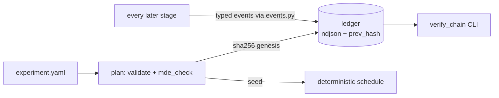

---
# MACHINE CONTRACT — see template header for consumers and YAML style rules.
kind: "story"
ticket: "EVAL-3"    # synthetic key — source: consolidated design pass 2026-07-02
parent: "EVAL-1"
title: "Experiment schemas, append-only hash-chained ledger, and the plan stage"
services: []
home: null          # inherited from EVAL-1
inherited_decisions:
  - "EVAL-1-D001"   # instrument residence + name (RESOLVED: verdi-bench)
  - "EVAL-1-D007"   # cost ceiling is a required experiment.yaml field (RESOLVED)
touchpoints:        # PLANNED symbols [judgment]
  - "harness/schema/experiment.py:ExperimentSpec"
  - "harness/ledger/chain.py:append_event"
  - "harness/ledger/chain.py:verify_chain"
  - "harness/ledger/events.py"
  - "harness/plan/lock.py:lock_experiment"
  - "harness/plan/power.py:mde_check"
  - "harness/cli.py:cmd_plan"
​
graph_provenance: []
​
acceptance:
  - id: "AC-1"
    text: "experiment.yaml validates against a schema requiring arms, corpus ref, repetitions, a primary metric from the fixed vocabulary, a decision rule, judge config, seed policy, and a cost ceiling; composites and missing ceilings are rejected."
    vc: "Valid fixtures pass; a composite primary metric and a missing cost_ceiling each fail plan with a named error."
    touchpoints:
      - "harness/schema/experiment.py:ExperimentSpec"
    tests:
      - "test_ac1_schema_valid"
      - "test_ac1_composite_metric_rejected"
      - "test_ac1_missing_cost_ceiling_rejected"
  - id: "AC-2"
    text: "plan sha256-locks experiment.yaml as the ledger genesis event; every later stage recomputes the hash and refuses to proceed on mismatch."
    vc: "Post-lock mutation of experiment.yaml causes run/grade/analyze entrypoints to refuse with the recorded vs computed hashes."
    touchpoints:
      - "harness/plan/lock.py:lock_experiment"
    tests:
      - "test_ac2_lock_genesis"
      - "test_ac2_mutation_refused"
  - id: "AC-3"
    text: "Every ledger event carries prev_hash (sha256 chain); verify_chain detects rewrite, deletion, and reorder, and is exposed as a CLI command."
    vc: "Tampering with any historical line makes verify_chain exit nonzero naming the first broken link; clean ledgers verify."
    touchpoints:
      - "harness/ledger/chain.py:append_event"
      - "harness/ledger/chain.py:verify_chain"
    tests:
      - "test_ac3_chain_append"
      - "test_ac3_tamper_detected"
      - "test_ac3_verify_cli"
  - id: "AC-4"
    text: "plan computes the minimum detectable effect from the design (paired, N x tasks x arms); a hypothesized effect below MDE requires --acknowledge-underpowered, and the acknowledgment is a ledger event carried into findings."
    vc: "Underpowered fixture refuses lock without the flag; with the flag, the acknowledged_underpowered event exists and the report renderer surfaces it."
    touchpoints:
      - "harness/plan/power.py:mde_check"
    tests:
      - "test_ac4_mde_computed"
      - "test_ac4_underpowered_requires_ack"
      - "test_ac4_ack_ledgered"
  - id: "AC-5"
    text: "The randomization seed is recorded at plan; trial interleave order is a pure function of (seed, trial set) and reproducible."
    vc: "Two schedule derivations from the same locked plan are identical; a different seed yields a different recorded order."
    touchpoints:
      - "harness/plan/lock.py:lock_experiment"
    tests:
      - "test_ac5_seed_recorded"
      - "test_ac5_interleave_deterministic"
  - id: "AC-6"
    text: "Every ledger event stamps instrument provenance (harness version + git sha) and event provenance (ts, actor, experiment id); events missing provenance fail schema."
    vc: "Appending an event without provenance raises; sampled events carry the running instrument's version and sha."
    touchpoints:
      - "harness/ledger/events.py"
    tests:
      - "test_ac6_event_provenance_stamped"
  - id: "AC-7"
    text: "Appends are atomic and fail closed: append_event returns the written event or raises; no code path performs a stage operation without its ledger event."
    vc: "Fault injection on write yields an exception and no partial line; stage entrypoints are property-tested to emit exactly one event per operation."
    touchpoints:
      - "harness/ledger/chain.py:append_event"
    tests:
      - "test_ac7_append_atomic"
      - "test_ac7_one_event_per_operation"
​
constraints:
  - text: "Ledger is ndjson with a sha256 prev_hash chain; one chain per ledger file."
    enforced_by: "test:test_ac3_chain_append"
  - text: "Pre-registration lock is the genesis event; primary metric and decision rule are immutable after lock."
    enforced_by: "test:test_ac2_mutation_refused"
  - text: "Underpowered designs proceed only with a ledgered acknowledgment that findings carry."
    enforced_by: "test:test_ac4_ack_ledgered"
  - text: "Opacity v1 is tamper-EVIDENT, not tamper-proof: same-user writes, chain verification detects rewrites; dedicated-UID resistance ships with the TRUSTED tier."
    enforced_by: "review"   # scope statement; verification itself is test:test_ac3_tamper_detected
​
decisions:
  - "EVAL-3-D001"   # underpowered policy: warn + ledgered ack (RESOLVED, jyang)
  - "EVAL-3-D002"   # opacity depth v1: tamper-evident (RESOLVED, jyang)
  - "EVAL-3-D003"   # ndjson + sha256 prev_hash (RESOLVED, default)
  - "EVAL-3-D004"   # sha256 genesis lock (RESOLVED, default)
  - "EVAL-3-D005"   # seed at plan, deterministic interleave (RESOLVED, default)
  - "EVAL-3-D006"   # fixed metric vocabulary, no composites (RESOLVED, default)
  - "EVAL-3-D007"   # power-model variance source (OPEN, audit 2026-07-02)
  - "EVAL-3-D008"   # lock hardening: head anchor + attestation (OPEN, audit)
open_decisions:
  - "EVAL-3-D007"
  - "EVAL-3-D008"
​
policy_proposals: []
predicted_reach: null
expected_verify: "n/a for groundwork; mechanical gate analog: AC suite green including chain-tamper and one-event-per-operation property tests."
---
​
# EVAL-3 — Experiment schemas, hash-chained ledger, and the plan stage
​
## Problem & context
​
Everything downstream — trials, grades, verdicts, findings — is only as
trustworthy as the substrate that records it. This story builds that
substrate: the experiment contract, the append-only tamper-evident ledger,
and the plan stage that locks a design before any data exists. It ships
first because every other story writes into it.
​
## Goal
​
A locked experiment is a cryptographic commitment: what will be measured,
how it will be decided, what it may cost, and in what order trials run —
fixed before the first token is spent, with every subsequent event chained
to it and stamped with instrument identity.
​
## Residence & runtime
​
Inherited from EVAL-1: instrument repo (name at EVAL-1-D001, declared
inherited), `harness/schema/`, `harness/ledger/`, `harness/plan/`.
​
## Design
​
**Schema.** `ExperimentSpec` validates experiment.yaml: `arms` (platform +
model + payload per arm), `corpus` ref, `repetitions`, `primary_metric`
from the fixed vocabulary {holdout_pass_rate, judge_preference,
cost_per_task, wall_time} [EVAL-3-D006], `decision_rule`, `judge` block
(EVAL-2 schema), `seed`, `cost_ceiling` (required; consumed by EVAL-4
enforcement) [EVAL-1-D007].
​
**Lock.** `plan` computes sha256 of the yaml and writes it as the genesis
event [EVAL-3-D004]. Every stage entrypoint recomputes and refuses on
mismatch — pre-registration as mechanism, not policy.
​
**Power.** `mde_check` derives the minimum detectable effect for the
declared design via seeded simulation under the paired-binary model
`[judgment: method detailed at build]`. Below-MDE hypotheses require
`--acknowledge-underpowered`, ledgered and carried into findings
[EVAL-3-D001] — an underpowered null can never masquerade as evidence.
​
**Chain.** ndjson events, each with `prev_hash`; `verify_chain` is a CLI
verb and the standing integrity check [EVAL-3-D002: tamper-evident v1 —
detection is the scientific requirement while local runs are ADVISORY;
dedicated-UID resistance arrives with the TRUSTED tier]. Typed
constructors in `events.py` (trial, grade, judge_verdict, human_verdict,
run_stopped_cost_ceiling, acknowledged_underpowered…) are the only write
path and stamp instrument version + sha into every event.
​
## Change surface
​

​
> Provenance: [judgment] hand-authored — greenfield.
​
## Acceptance criteria mapping
​
AC-1/AC-2 make the experiment a validated, immutable commitment. AC-3
makes history tamper-evident and checkable on demand. AC-4
operationalizes the underpowered policy as ledger mechanics. AC-5 pins
reproducible randomization for EVAL-4's interleaving. AC-6/AC-7 extend
the fail-closed and provenance invariants to the substrate itself: no
unstamped events, no unledgered operations.
​
## Expected post-state
​
Ledger module importable by every sibling story; `bench plan` and
`bench verify-chain` functional against fixture experiments; the gate
analog (full AC suite, including tamper and atomicity property tests)
green.
​
## Out of scope
​
Dedicated-UID/container ledger ownership (TRUSTED tier); ledger
compaction/archival; multi-experiment cross-ledger queries.
​
## Open questions
​
- EVAL-3-D007 — power-model variance source [audit].
- EVAL-3-D008 — lock-integrity hardening: head anchoring + attestation [audit].
​
Inherited EVAL-1-D001 resolved (verdi-bench); gate blocked by the two audit
items above.