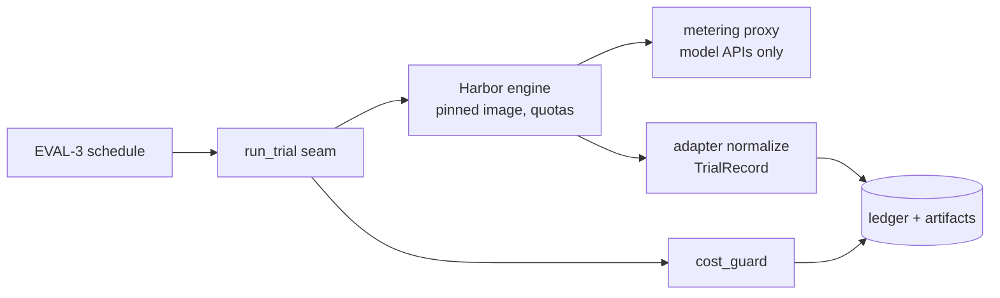

---
# MACHINE CONTRACT — see template header for consumers and YAML style rules.
kind: "story"
ticket: "EVAL-4"    # synthetic key — source: consolidated design pass 2026-07-02
parent: "EVAL-1"
title: "Run stage: run-trial seam over Harbor, stack adapters, hermetic trials, cost guard"
services: []
home: null          # inherited from EVAL-1
inherited_decisions:
  - "EVAL-1-D001"   # instrument residence + name (RESOLVED: verdi-bench)
  - "EVAL-1-D005"   # runner: harbor behind run-trial seam (RESOLVED)
  - "EVAL-1-D006"   # local-only ADVISORY first (RESOLVED)
  - "EVAL-1-D007"   # hard cost ceiling enforced by run (RESOLVED)
touchpoints:        # PLANNED symbols [judgment]
  - "harness/run/seam.py:run_trial"
  - "harness/run/interleave.py:schedule"
  - "harness/run/budget.py:cost_guard"
  - "harness/run/egress.py:proxy_config"
  - "harness/adapters/base.py:TrialRecord"
  - "harness/adapters/claude_code.py:ClaudeCodeAdapter"
  - "harness/adapters/codex.py:CodexAdapter"
​
graph_provenance: []
​
acceptance:
  - id: "AC-1"
    text: "run_trial is the single execution seam ((task, arm, workspace) -> TrialRecord); Harbor is an implementation detail behind it and engine swap touches only the seam implementation."
    vc: "A fake-engine implementation passes the identical seam contract suite that the Harbor implementation passes; no module outside the seam imports Harbor."
    touchpoints:
      - "harness/run/seam.py:run_trial"
    tests:
      - "test_ac1_seam_contract"
      - "test_ac1_engine_isolated"
  - id: "AC-2"
    text: "claude-code and codex adapters emit a normalized TrialRecord (tokens in/out/cache, cost, wall time, tool calls, exit status); unmeasurable fields are null, never estimated."
    vc: "Fixture agent logs normalize to identical schemas per adapter; a field absent from native telemetry is null in the record and flagged, not imputed."
    touchpoints:
      - "harness/adapters/claude_code.py:ClaudeCodeAdapter"
      - "harness/adapters/codex.py:CodexAdapter"
    tests:
      - "test_ac2_claude_code_normalization"
      - "test_ac2_codex_normalization"
      - "test_ac2_null_not_estimated"
  - id: "AC-3"
    text: "Trials are hermetic: images pre-baked with pinned agent binaries and task deps (digests in provenance); trial-time egress is model APIs via the metering proxy only; any other attempt is logged and the trial flagged."
    vc: "A trial attempting non-allowlisted egress produces a proxy log entry and an egress_violation flag on its record; image digests appear in trial provenance."
    touchpoints:
      - "harness/run/egress.py:proxy_config"
    tests:
      - "test_ac3_egress_flagged"
      - "test_ac3_image_digest_provenance"
  - id: "AC-4"
    text: "Trials execute in the seed-derived randomized interleave across arms (consuming the EVAL-3 schedule); the executed order is ledgered."
    vc: "Executed order matches the deterministic schedule for the locked seed; arm-blocked execution is unrepresentable through the scheduler API."
    touchpoints:
      - "harness/run/interleave.py:schedule"
    tests:
      - "test_ac4_interleave_from_seed"
      - "test_ac4_executed_order_ledgered"
  - id: "AC-5"
    text: "Timeout is an outcome (30m default, per-task override); there are no silent retries; infra failures are ledgered and re-run as new trials."
    vc: "A hung fixture trial records outcome=timeout; a fault-injected infra failure yields a trial_infra_failed event plus a distinct new trial id, never a mutated old one."
    touchpoints:
      - "harness/run/seam.py:run_trial"
    tests:
      - "test_ac5_timeout_outcome"
      - "test_ac5_no_silent_retry"
      - "test_ac5_infra_rerun_new_trial"
  - id: "AC-6"
    text: "Per-trial CPU/mem quotas are pinned; wall-time carries a contention caveat flag whenever concurrency exceeds one."
    vc: "Container inspect shows the configured quotas; records from a concurrent run carry the caveat, serial-run records do not."
    touchpoints:
      - "harness/run/seam.py:run_trial"
    tests:
      - "test_ac6_quota_applied"
      - "test_ac6_contention_flag"
  - id: "AC-7"
    text: "Accumulated cost is tracked from trial records; run refuses to start a trial past the experiment's cost ceiling and ledgers the stop."
    vc: "A fixture crossing the ceiling mid-run starts no further trials and emits run_stopped_cost_ceiling with the accumulated figure."
    touchpoints:
      - "harness/run/budget.py:cost_guard"
    tests:
      - "test_ac7_ceiling_stops"
      - "test_ac7_stop_ledgered"
  - id: "AC-8"
    text: "Provider keys are env-injected at trial start, never baked into images or written to the ledger; known key patterns are redacted at artifact capture."
    vc: "Image layers contain no key material; a transcript fixture echoing a key is redacted in captured artifacts."
    touchpoints:
      - "harness/adapters/base.py:TrialRecord"
    tests:
      - "test_ac8_redaction"
      - "test_ac8_no_keys_in_images"
  - id: "AC-9"
    text: "The agent under test never sees rubric or holdout content: task images and injected prompts are property-tested against holdout canaries; local trial records are stamped ADVISORY."
    vc: "Canary strings seeded in holdouts never appear in the trial container filesystem or prompt payloads; every local record carries provenance tier ADVISORY."
    touchpoints:
      - "harness/run/seam.py:run_trial"
    tests:
      - "test_ac9_holdout_canaries_absent"
      - "test_ac9_advisory_stamp"
​
constraints:
  - text: "No module outside the seam implementation imports the trial engine."
    enforced_by: "test:test_ac1_engine_isolated"
  - text: "Hermetic trials: pre-baked pinned images, model-API-only egress, violations flagged not tolerated."
    enforced_by: "test:test_ac3_egress_flagged"
  - text: "Silent retries are unrepresentable; every re-run is a new ledgered trial."
    enforced_by: "test:test_ac5_no_silent_retry"
  - text: "Harbor and agent binary versions are pinned; image digests are trial provenance."
    enforced_by: "test:test_ac3_image_digest_provenance"
​
decisions:
  - "EVAL-4-D001"   # hermetic pre-baked egress policy (RESOLVED, jyang)
  - "EVAL-4-D002"   # retries/timeouts lifecycle (RESOLVED, default)
  - "EVAL-4-D003"   # pinned quotas + contention caveat (RESOLVED, default)
  - "EVAL-4-D004"   # agent-native telemetry, null-not-estimated, redaction (RESOLVED, default)
  - "EVAL-4-D005"   # version-pinned images, digests in provenance (RESOLVED, default)
open_decisions: []
​
policy_proposals: []
predicted_reach: null
expected_verify: "n/a for groundwork; mechanical gate analog: AC suite green including the seam-contract suite run against both the Harbor and fake engines, and the holdout-canary property test."
---
​
# EVAL-4 — Run stage: seam, adapters, hermetic trials, cost guard
​
## Problem & context
​
This is where insulation is won or lost. Trials must run real products
(Claude Code, Codex) unmodified, in environments where the only variable
is the declared arm difference — no registry drift between arms, no
mid-run installs, no rubric leakage, no silent retries laundering
variance, no orchestrator steering. Build-time verification items carried
from discovery: Harbor's agent-install network behavior, proxy
interposition inside its containers, and native telemetry depth — all
three are Phase-0 checks of this story's build, and each degrades to a
documented fallback (pre-baked installs, sidecar proxy, adapter log
parsing) rather than a compromise.
​
## Goal
​
A trial is a sealed event: pinned image in, one prompt in, artifacts and
a normalized TrialRecord out, every deviation (timeout, infra failure,
egress attempt, ceiling stop) recorded as data rather than handled as
exception.
​
## Residence & runtime
​
Inherited from EVAL-1; this story owns `harness/run/` and
`harness/adapters/`. The existing Squid/devcontainer egress architecture
drops in as the metering proxy.
​
## Design
​
**Seam** [EVAL-1-D005]. `run_trial` is the only door to execution; the
Harbor implementation and a fake engine both pass one contract suite,
which is what makes the runner decision reversible.
​
**Adapters.** Per-stack normalization to `TrialRecord`; unmeasurable
fields null with a flag [EVAL-4-D004] — cross-stack comparisons then run
only on fields both stacks measure, enforced downstream by EVAL-6.
​
**Hermeticity** [EVAL-4-D001]. Task images pre-bake agent binaries and
task deps at corpus-build time, digests pinned [EVAL-4-D005]. The proxy
allowlists model API hosts, meters usage as a cross-check signal, and
turns every other egress attempt into recorded evidence.
​
**Lifecycle** [EVAL-4-D002]. Outcomes, not exceptions: timeout, infra
failure (re-run = new trial), ceiling stop [EVAL-1-D007 via
`cost_guard`]. Interleaving executes EVAL-3's seed-derived schedule
[EVAL-4-AC-4]; quotas pin compute so wall-time stays meaningful
[EVAL-4-D003].
​
## Change surface
​

​
> Provenance: [judgment] hand-authored — greenfield.
​
## Acceptance criteria mapping
​
AC-1 keeps the engine swappable. AC-2 makes cross-stack telemetry honest.
AC-3/AC-9 are the insulation pair — nothing forbidden gets out, nothing
identifying gets in. AC-4 executes the pre-registered randomization.
AC-5/AC-7 turn failure and budget into ledger events. AC-6 protects the
wall-time metric. AC-8 keeps secrets out of every artifact class.
​
## Expected post-state
​
`bench run` executes a two-arm fixture experiment end to end on local
Docker, producing chained trial events, ADVISORY-stamped records, and
artifacts ready for EVAL-5/EVAL-2 grading.
​
## Out of scope
​
OpenCode adapter (arrives with the model-vs-model phase per EVAL-1-D003);
cloud sandbox providers; the TRUSTED CI tier.
​
## Open questions
​
None — local ledger clean, inherited EVAL-1-D001 resolved (verdi-bench).
Gate clear.