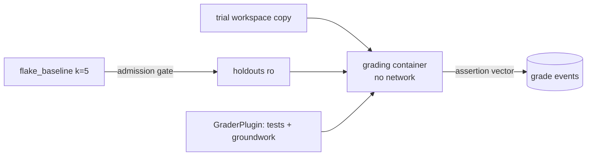

--
# MACHINE CONTRACT — see template header for consumers and YAML style rules.
kind: "story"
ticket: "EVAL-5"    # synthetic key — source: consolidated design pass 2026-07-02
parent: "EVAL-1"
title: "Deterministic grading: isolated holdout execution, flake baselining, grader plugins"
services: []
home: null          # inherited from EVAL-1
inherited_decisions:
  - "EVAL-1-D001"   # instrument residence + name (RESOLVED: verdi-bench)
touchpoints:        # PLANNED symbols [judgment]
  - "harness/grade/deterministic.py:grade_trial"
  - "harness/grade/baseline.py:flake_baseline"
  - "harness/grade/plugins.py:GraderPlugin"
  - "harness/grade/plugins/groundwork.py:GroundworkGrader"
​
graph_provenance: []
​
acceptance:
  - id: "AC-1"
    text: "Grading runs in a fresh container against a copy of the trial's final workspace, holdouts mounted read-only, no network."
    vc: "The grading container has no network namespace access; holdout mounts reject writes; the trial container is never reused for grading."
    touchpoints:
      - "harness/grade/deterministic.py:grade_trial"
    tests:
      - "test_ac1_grading_isolated"
      - "test_ac1_holdouts_readonly"
  - id: "AC-2"
    text: "Flake baseline runs each task's holdouts k=5 against the unmodified workspace; any failure quarantines that task version, and baseline results are ledgered with the task sha."
    vc: "A fixture task with a flaky holdout is quarantined and excluded from run scheduling; the baseline event carries k results and the task sha."
    touchpoints:
      - "harness/grade/baseline.py:flake_baseline"
    tests:
      - "test_ac2_baseline_quarantine"
      - "test_ac2_baseline_ledgered"
  - id: "AC-3"
    text: "Per-assertion results are always recorded; the primary deterministic score is binary task-level; fractional scoring is available only when pre-registered in the locked experiment.yaml."
    vc: "Grade events contain the full assertion vector; an experiment without pre-registered fractional scoring cannot render a fractional primary."
    touchpoints:
      - "harness/grade/deterministic.py:grade_trial"
    tests:
      - "test_ac3_per_assertion_recorded"
      - "test_ac3_binary_default"
      - "test_ac3_fractional_requires_prereg"
  - id: "AC-4"
    text: "GraderPlugin is a declared-per-task interface ((workspace, task) -> assertions); the groundwork plugin exposes verify/fitness-rule outcomes as assertions for internal Go tasks."
    vc: "A fixture plugin conforming to the interface contributes assertions to the grade event; the groundwork plugin maps rule verdicts to assertion results with rule ids preserved."
    touchpoints:
      - "harness/grade/plugins.py:GraderPlugin"
      - "harness/grade/plugins/groundwork.py:GroundworkGrader"
    tests:
      - "test_ac4_plugin_contract"
      - "test_ac4_groundwork_plugin"
  - id: "AC-5"
    text: "Grading failures fail closed to a CANT_GRADE(reason) event; an attempted grade without a grade event is unrepresentable."
    vc: "Fault-injected grading (container failure, malformed holdout output) yields exactly one CANT_GRADE event with a machine-readable reason."
    touchpoints:
      - "harness/grade/deterministic.py:grade_trial"
    tests:
      - "test_ac5_fail_closed"
​
constraints:
  - text: "Holdouts are never present in trial containers and never writable in grading containers."
    enforced_by: "test:test_ac1_holdouts_readonly"
  - text: "A task version cannot be scheduled without a clean ledgered flake baseline."
    enforced_by: "test:test_ac2_baseline_quarantine"
  - text: "The deterministic layer contains no LLM calls."
    enforced_by: "review"   # structural; candidate import-lint once the repo exists
​
decisions:
  - "EVAL-5-D001"   # flake baseline k=5, zero tolerance (RESOLVED, default)
  - "EVAL-5-D002"   # binary primary, fractional pre-registered (RESOLVED, default)
open_decisions: []
​
policy_proposals: []
predicted_reach: null
expected_verify: "n/a for groundwork as gate; note the inversion — here groundwork is a grader plugin inside the instrument, not the instrument's own gate. Mechanical gate analog: AC suite green."
---
​
# EVAL-5 — Deterministic grading
​
## Problem & context
​
Layer-0 verdicts must be beyond argument: same workspace, same holdouts,
same result, every time. Two things threaten that — flaky tests grading
noise as signal, and grading environments contaminated by trial state.
This story eliminates both, and defines the plugin seam through which
internal tasks get richer-than-tests assertions (groundwork rule verdicts)
for free.
​
## Goal
​
Every trial receives exactly one deterministic grade event containing the
full assertion vector, produced in an isolated environment, against
holdouts proven non-flaky before any agent ever ran.
​
## Residence & runtime
​
Inherited from EVAL-1; this story owns `harness/grade/`.
​
## Design
​
**Isolation.** Fresh grading container per trial: workspace copied in,
holdouts mounted read-only, network off. Nothing the agent did to its
container survives into grading; nothing in grading can leak back.
​
**Flake baseline** [EVAL-5-D001]. Holdouts run k=5 against the pristine
workspace at corpus-admission time; any failure quarantines the task
version. Zero tolerance is cheap here (no agent involved) and buys the
right to treat every downstream failure as signal. Baselines are ledgered
with task shas — a finding can prove its tasks were sound.
​
**Scoring** [EVAL-5-D002]. Record everything, decide simply: assertion
vectors always captured; primary score binary at task level (matching
published calibration numbers); fractional available only by
pre-registration, closing the choose-your-scoring-after-the-fact hole.
​
**Plugins.** `GraderPlugin` declared per task. The groundwork plugin maps
`verify`/fitness-rule verdicts into assertions with rule ids preserved —
the internal benchmark grades on structural properties, not just tests.
An abstention (NO-STRUCTURAL-SIGNAL) maps to an abstained assertion,
never a pass `[judgment: consistent with verdi-go epistemics]`.
​
## Change surface
​

​
> Provenance: [judgment] hand-authored — greenfield.
​
## Acceptance criteria mapping
​
AC-1 seals the environment. AC-2 makes task soundness a precondition
rather than a hope. AC-3 separates data capture from scoring policy.
AC-4 opens the assertion surface to structural graders. AC-5 extends
fail-closed: no grade can silently not happen.
​
## Expected post-state
​
`bench grade` produces chained grade events for a fixture experiment;
quarantine list functional; groundwork plugin demonstrated against a
fixture Go task.
​
## Out of scope
​
Non-code task graders; grading-container caching; flake-rate-threshold
policies (zero tolerance until data argues otherwise).
​
## Open questions
​
None — local ledger clean, inherited EVAL-1-D001 resolved (verdi-bench).
Gate clear.