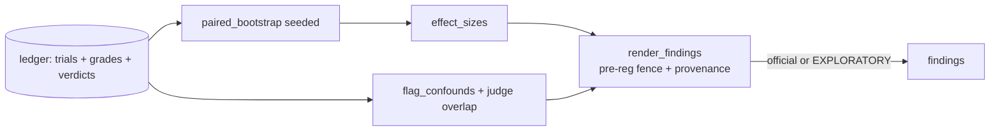

--
# MACHINE CONTRACT — see template header for consumers and YAML style rules.
kind: "story"
ticket: "EVAL-6"    # synthetic key — source: consolidated design pass 2026-07-02
parent: "EVAL-1"
title: "Analyze: paired statistics, effect sizes, confound flags, pre-registration fence"
services: []
home: null          # inherited from EVAL-1
inherited_decisions:
  - "EVAL-1-D001"   # instrument residence + name (RESOLVED: verdi-bench)
touchpoints:        # PLANNED symbols [judgment]
  - "harness/analyze/stats.py:paired_bootstrap"
  - "harness/analyze/effect.py:effect_sizes"
  - "harness/analyze/confounds.py:flag_confounds"
  - "harness/analyze/report.py:render_findings"
​
graph_provenance: []
​
acceptance:
  - id: "AC-1"
    text: "Analysis is paired: per-task deltas between arms, 95% CI from 10k bootstrap resamples, seed-controlled and reproducible."
    vc: "Two analyze runs over the same ledger with the same seed produce byte-identical statistics; known fixture deltas recover expected CIs."
    touchpoints:
      - "harness/analyze/stats.py:paired_bootstrap"
    tests:
      - "test_ac1_paired_bootstrap"
      - "test_ac1_reproducible_seeded"
  - id: "AC-2"
    text: "Every comparison reports effect sizes (mean paired delta and Cliff's delta) alongside the CI, never a bare significance claim."
    vc: "Report fixtures without effect sizes fail rendering validation; computed values match hand-checked fixtures."
    touchpoints:
      - "harness/analyze/effect.py:effect_sizes"
    tests:
      - "test_ac2_effect_sizes"
  - id: "AC-3"
    text: "The MDE from plan appears in every findings render; null results are phrased as no effect >= MDE detected; secondary metrics are labeled exploratory."
    vc: "A null fixture renders the MDE-bounded phrasing verbatim in structure; secondaries carry the exploratory label; the acknowledged_underpowered flag surfaces when present."
    touchpoints:
      - "harness/analyze/report.py:render_findings"
    tests:
      - "test_ac3_mde_in_report"
      - "test_ac3_null_phrasing"
  - id: "AC-4"
    text: "Auto confound flags are computed from ledger and telemetry: interleave imbalance, provider-error asymmetry, telemetry-null asymmetry, egress violations, version drift, plus judge_vendor_overlap registered from the judge layer."
    vc: "Fixtures constructed to exhibit each condition emit exactly the expected flag; clean fixtures emit none."
    touchpoints:
      - "harness/analyze/confounds.py:flag_confounds"
    tests:
      - "test_ac4_flags_emitted"
      - "test_ac4_clean_fixture_no_flags"
  - id: "AC-5"
    text: "Official findings render only for the pre-registered primary metric and decision rule from the locked experiment.yaml; anything else renders with an EXPLORATORY watermark and cannot be emitted as official."
    vc: "Requesting an official render for an unregistered metric is refused; the exploratory path watermarks every page of output."
    touchpoints:
      - "harness/analyze/report.py:render_findings"
    tests:
      - "test_ac5_unregistered_refused"
      - "test_ac5_exploratory_watermark"
  - id: "AC-6"
    text: "Findings carry full provenance: instrument version + sha, corpus version + task shas, ledger head hash, judge provenance summary, and every active confound flag."
    vc: "Rendered findings missing any provenance field fail validation; the ledger head hash in a finding matches verify_chain output at render time."
    touchpoints:
      - "harness/analyze/report.py:render_findings"
    tests:
      - "test_ac6_finding_provenance"
  - id: "AC-7"
    text: "Cross-stack comparisons compute only over telemetry fields both arms measured; a metric with asymmetric nulls is excluded from official comparison and flagged, never imputed."
    vc: "A fixture where one adapter lacks cache-token telemetry yields no official cache comparison and a telemetry-null-asymmetry flag."
    touchpoints:
      - "harness/analyze/stats.py:paired_bootstrap"
    tests:
      - "test_ac7_asymmetric_nulls_excluded"
​
constraints:
  - text: "No official output exists outside the pre-registered primary metric and decision rule."
    enforced_by: "test:test_ac5_unregistered_refused"
  - text: "Statistics are seed-reproducible; analyze is a pure function of (ledger, seed)."
    enforced_by: "test:test_ac1_reproducible_seeded"
  - text: "Raw token counts are never compared across vendors; cross-vendor comparisons run on cost, latency, and outcomes."
    enforced_by: "review"   # candidate schema-level rule at build
​
decisions:
  - "EVAL-6-D001"   # 95% CI, 10k paired bootstrap, mean delta + Cliff's delta (RESOLVED, default)
  - "EVAL-6-D002"   # auto confound flag set (RESOLVED, default)
  - "EVAL-6-D003"   # MDE always reported, null phrasing, exploratory labels (RESOLVED, default)
  - "EVAL-6-D004"   # CI method by empirical coverage (OPEN, audit 2026-07-02)
open_decisions:
  - "EVAL-6-D004"
​
policy_proposals: []
predicted_reach: null
expected_verify: "n/a for groundwork; mechanical gate analog: AC suite green including fixture-recovery of known statistics and the fence tests."
---
​
# EVAL-6 — Analyze
​
## Problem & context
​
This stage is where soundness is usually lost in homegrown evals: metrics
chosen after seeing data, unpaired comparisons eating task-difficulty
variance, "no difference" claims from underpowered designs, and confounds
nobody looked for. Analyze exists to make those failure modes mechanical
impossibilities rather than reviewer catches.
​
## Goal
​
A pure, reproducible function from (ledger, seed) to findings that state
exactly what the pre-registered design can support — effect sizes with
uncertainty, nulls bounded by MDE, confounds surfaced automatically —
and refuse to state anything else officially.
​
## Residence & runtime
​
Inherited from EVAL-1; this story owns `harness/analyze/`, including the
confounds module the judge layer registers into (EVAL-2 AC-6).
​
## Design
​
**Paired statistics** [EVAL-6-D001]. Per-task deltas neutralize task
difficulty; 10k seeded bootstrap resamples give the 95% CI; effect sizes
(mean paired delta + Cliff's delta) accompany every claim. Analyze is
deliberately a pure function — same ledger, same seed, same bytes —
which makes findings independently recomputable by a reviewer.
​
**The fence** [pre-registration, consuming EVAL-3's lock]. Official
renders exist only for the locked primary metric and decision rule;
everything else is watermarked EXPLORATORY on every page. Combined with
the ledgered-everything substrate, "rerun until it looks good" and
"report the metric that moved" both become visible artifacts instead of
silent choices.
​
**Confounds** [EVAL-6-D002]. Five automatic flags from ledger and
telemetry, plus judge_vendor_overlap registered by the judge layer.
Flags don't invalidate findings; they ride them — disclosure over
suppression, consistent with the judge-vendor decision.
​
**Honest nulls and honest cross-stack** [EVAL-6-D003, AC-7]. Every
finding carries the MDE; nulls are "no effect ≥ MDE detected."
Asymmetric telemetry nulls exclude a metric from official comparison
rather than inviting imputation; token counts never cross vendors.
​
## Change surface
​

​
> Provenance: [judgment] hand-authored — greenfield.
​
## Acceptance criteria mapping
​
AC-1/AC-2 establish the statistical core and its reproducibility.
AC-3 makes underpowered and null results honest by construction. AC-4
automates confound discovery. AC-5 is the fence — the single strongest
anti-p-hacking mechanism in the harness. AC-6 makes findings citable
evidence. AC-7 keeps cross-stack claims inside what was actually
measured.
​
## Expected post-state
​
`bench analyze` renders official findings for a fixture experiment and
refuses an off-registration render; all statistics recover hand-checked
fixture values; confound fixtures flag correctly.
​
## Out of scope
​
Sequential/interim analysis and early stopping rules; Bayesian
alternatives; multi-experiment meta-analysis.
​
## Open questions
​
- EVAL-6-D004 — CI method selected by empirical coverage under the null
  harness [audit].
​
Inherited EVAL-1-D001 resolved (verdi-bench).