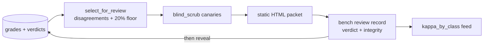

---
# MACHINE CONTRACT — see template header for consumers and YAML style rules.
kind: "story"
ticket: "EVAL-7"    # synthetic key — source: consolidated design pass 2026-07-02
parent: "EVAL-1"
title: "Human review packet: blinded evidence, measured integrity, verdict capture, kappa feed"
services: []
home: null          # inherited from EVAL-1
inherited_decisions:
  - "EVAL-1-D001"   # instrument residence + name (RESOLVED: verdi-bench)
touchpoints:        # PLANNED symbols [judgment]
  - "harness/review/packet.py:build_review_packet"
  - "harness/review/scrub.py:blind_scrub"
  - "harness/review/sample.py:select_for_review"
  - "harness/cli.py:cmd_review_record"
​
graph_provenance: []
​
acceptance:
  - id: "AC-1"
    text: "The review packet is blinded with the same canary machinery as judge packets: arm labels, agent/model names, and known identity patterns are scrubbed from all rendered evidence."
    vc: "Canary identity strings seeded through fixture artifacts never appear in the rendered packet; scrub failures block packet generation."
    touchpoints:
      - "harness/review/scrub.py:blind_scrub"
    tests:
      - "test_ac1_scrub_canaries"
  - id: "AC-2"
    text: "Review sampling is the mandatory disagreement set (deterministic-vs-judge conflicts, order-inconsistent, CANT_JUDGE) plus a seed-derived 20% random floor of agreements; kappa is computed only over the human-reviewed set."
    vc: "Fixture ledgers yield exactly the mandatory set plus the reproducible floor; kappa computation excludes unreviewed comparisons."
    touchpoints:
      - "harness/review/sample.py:select_for_review"
    tests:
      - "test_ac2_mandatory_set"
      - "test_ac2_random_floor_seeded"
      - "test_ac2_kappa_reviewed_only"
  - id: "AC-3"
    text: "The packet is a self-contained static HTML bundle (side-by-side diffs, holdout results, task prompt) ordered disagreements-first; judge verdicts and arm identities are not present in the packet."
    vc: "The bundle opens offline with no external requests; packet HTML contains no judge verdict fields and no arm identifiers."
    touchpoints:
      - "harness/review/packet.py:build_review_packet"
    tests:
      - "test_ac3_html_selfcontained"
      - "test_ac3_no_judge_or_arm_content"
  - id: "AC-4"
    text: "bench review record captures the human verdict (schema mirroring judge verdicts) plus blinding-integrity fields (arm recognized? y/n + guess) strictly before any unblinding; only then are judge verdict and arm identity revealed."
    vc: "The CLI refuses to reveal before a verdict + integrity event is ledgered; the reveal event references the verdict event id."
    touchpoints:
      - "harness/cli.py:cmd_review_record"
    tests:
      - "test_ac4_verdict_event_schema"
      - "test_ac4_integrity_pre_unblind"
      - "test_ac4_reveal_after_verdict"
  - id: "AC-5"
    text: "Recorded human verdicts feed per-task-class kappa (consumed by the judge layer's calibration) and are the only events that close comparisons."
    vc: "Human verdict fixtures change kappa_by_class outputs; comparisons without human verdicts remain open in ledger state."
    touchpoints:
      - "harness/review/sample.py:select_for_review"
    tests:
      - "test_ac5_kappa_feed"
  - id: "AC-6"
    text: "The blinding-integrity rate (share of reviews where the arm was recognized, and guess accuracy) is computed and rides every findings render."
    vc: "Findings for a fixture with recognition events display the integrity rate; a findings render missing it fails validation."
    touchpoints:
      - "harness/review/packet.py:build_review_packet"
    tests:
      - "test_ac6_integrity_rate_reported"
​
constraints:
  - text: "Human verdict and integrity fields are captured before any unblinding; the reveal path is unreachable earlier."
    enforced_by: "test:test_ac4_integrity_pre_unblind"
  - text: "The packet shares one scrub implementation with judge packets — a single blinding codepath to test."
    enforced_by: "test:test_ac1_scrub_canaries"
  - text: "Blinding is measured, never asserted: integrity rate is part of every finding."
    enforced_by: "test:test_ac6_integrity_rate_reported"
​
decisions:
  - "EVAL-7-D001"   # static HTML + CLI verdict capture (RESOLVED, jyang)
  - "EVAL-7-D002"   # disagreements + 20% random floor (RESOLVED, jyang)
  - "EVAL-7-D003"   # kappa estimator: IPW + floor sensitivity (OPEN, audit)
open_decisions:
  - "EVAL-7-D003"
​
policy_proposals: []
predicted_reach: null
expected_verify: "n/a for groundwork; mechanical gate analog: AC suite green including the pre-unblind ordering tests."
---
​
# EVAL-7 — Human review packet
​
## Problem & context
​
The human is the final judge, but a human anchored by the machine's
opinion, or reviewing an unblinded packet, or sampled only on
disagreements, produces verdicts that can't calibrate anything. This
story makes the human layer as methodologically careful as the machine
layers it supervises.
​
## Goal
​
Sufficient blinded evidence, bounded workload, verdicts captured before
any reveal, and a measured — not assumed — blind, feeding a kappa the
judge must earn.
​
## Residence & runtime
​
Inherited from EVAL-1; this story owns `harness/review/` and the
`review record` CLI verb.
​
## Design
​
**Sampling** [EVAL-7-D002]. Mandatory set: every disagreement
(deterministic-vs-judge, order-inconsistent, CANT_JUDGE). Random floor:
seed-derived 20% of agreements — without it, kappa would be computed on
a sample selected *for* disagreement and biased low by construction.
Kappa counts only reviewed comparisons.
​
**Packet** [EVAL-7-D001]. Self-contained static HTML per experiment:
side-by-side diffs, holdout output, task prompt; disagreements first.
The packet deliberately excludes judge verdicts and arm identities —
anchoring protection derived from the resolved blinding design
`[judgment, derived from EVAL-2-D002/blinding-measured]`: revealing the
judge's opinion before the human's is a partial unblind.
​
**Capture and reveal** [AC-4]. `bench review record` takes the verdict
(schema mirrors judge verdicts, so kappa is directly computable) plus
the integrity questions — "could you identify the arm? guess?" — and
only then reveals judge verdict and identities, as a ledgered reveal
event referencing the verdict. The ordering is enforced by the tool, not
by discipline.
​
**Integrity as data** [AC-6]. The recognition rate ships with every
finding. A high rate doesn't invalidate results; it bounds how much the
blind can be credited — measurement over assertion, same as everywhere
else in the harness.
​
## Change surface
​

​
> Provenance: [judgment] hand-authored — greenfield.
​
## Acceptance criteria mapping
​
AC-1/AC-3 keep the evidence blind and self-contained. AC-2 bounds
workload without biasing calibration. AC-4 is the anchoring firewall —
verdict before reveal, mechanically. AC-5 wires the human into closure
and calibration. AC-6 turns the blind itself into reported data.
​
## Expected post-state
​
A fixture experiment produces a browsable packet; recording a verdict
via CLI closes the comparison, updates kappa inputs, and unlocks the
reveal; integrity rate appears in findings.
​
## Out of scope
​
Multi-reviewer workflows and inter-rater reliability; web-served (vs
static) packets; annotation beyond the verdict schema.
​
## Open questions
​
- EVAL-7-D003 — kappa estimator correction: inverse-probability-weighted +
  floor-only sensitivity [audit; replaces the "unbiased" claim].
​
Inherited EVAL-1-D001 resolved (verdi-bench).