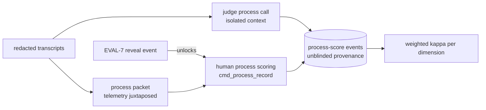

---
# MACHINE CONTRACT — see template header for consumers and YAML style rules.
kind: "story"
ticket: "EVAL-9"    # synthetic key — source: EVAL-2-D007 resolution 2026-07-02
parent: "EVAL-1"
title: "Transcript process rubric: openly-unblinded diagnostic scoring with firewall mechanisms"
services: []
home: null          # inherited from EVAL-1 (verdi-bench)
inherited_decisions:
  - "EVAL-1-D001"   # instrument residence + name (RESOLVED: verdi-bench)
touchpoints:        # PLANNED symbols [judgment]
  - "harness/process/rubric.py:ProcessRubric"
  - "harness/process/score.py:score_trial_process"
  - "harness/process/packet.py:build_process_packet"
  - "harness/cli.py:cmd_process_record"
​
graph_provenance: []
​
acceptance:
  - id: "AC-1"
    text: "The process rubric is a versioned schema of anchored ordinal dimensions scored per trial; rubric version is stamped into every process-score event."
    vc: "Score events without a rubric version fail schema; changing a dimension anchor bumps the version; fixtures score against a pinned rubric."
    touchpoints:
      - "harness/process/rubric.py:ProcessRubric"
    tests:
      - "test_ac1_rubric_versioned"
      - "test_ac1_ordinal_schema"
  - id: "AC-2"
    text: "Every process score carries unblinded provenance: unblinded=true, scorer identity (judge model id or human), and the judge_vendor_overlap flag when the scorer's vendor appears in an arm; any render displaying process scores must include the disclosure."
    vc: "A process score without unblinded provenance is unrepresentable; findings fixtures that include process scores fail validation when the disclosure block is absent."
    touchpoints:
      - "harness/process/score.py:score_trial_process"
    tests:
      - "test_ac2_unblinded_provenance"
      - "test_ac2_disclosure_required"
  - id: "AC-3"
    text: "Sequencing firewall: human process scoring is only reachable after the EVAL-7 reveal event for that comparison; judge process scoring runs in a separate model call sharing no context with outcome verdicts."
    vc: "cmd_process_record refuses before a referenced reveal event exists; the judge process call contains no outcome-verdict content by construction (packet-builder property test)."
    touchpoints:
      - "harness/cli.py:cmd_process_record"
      - "harness/process/packet.py:build_process_packet"
    tests:
      - "test_ac3_human_post_reveal_only"
      - "test_ac3_judge_call_isolated"
  - id: "AC-4"
    text: "The LLM judge scores all trials; transcripts are delivered post-redaction and in full, or the score fails closed to CANT_SCORE(reason) — no silent truncation."
    vc: "A transcript exceeding judge context yields CANT_SCORE with token counts recorded; redaction canaries never reach the judge payload."
    touchpoints:
      - "harness/process/score.py:score_trial_process"
    tests:
      - "test_ac4_full_or_cant_score"
      - "test_ac4_redaction_upstream"
  - id: "AC-5"
    text: "Human process scores are captured on the EVAL-7 reviewed sample; per-dimension judge-human agreement uses quadratic-weighted kappa (ordinal scales) with the same IPW correction and gate mechanics as outcome kappa."
    vc: "Weighted-kappa fixtures recover hand-checked values; dimension gates escalate independently; the estimator matches the EVAL-7-D003 resolution."
    touchpoints:
      - "harness/process/score.py:score_trial_process"
    tests:
      - "test_ac5_weighted_kappa"
      - "test_ac5_per_dimension_gates"
  - id: "AC-6"
    text: "Metric firewall: process dimensions are ineligible as primary metrics (the EVAL-3 closed vocabulary is unchanged); they render only as EXPLORATORY-labeled secondaries carrying the unblinded disclosure."
    vc: "Registering a process dimension as primary_metric fails schema validation; official renders including process scores show both the exploratory label and the disclosure."
    touchpoints:
      - "harness/process/rubric.py:ProcessRubric"
    tests:
      - "test_ac6_primary_ineligible"
      - "test_ac6_exploratory_rendering"
  - id: "AC-7"
    text: "The process packet juxtaposes deterministic telemetry correlates (tokens, tool calls, wall time, retries, timeouts) beside each scored dimension; analyze reports score-vs-telemetry correlation as a sanity signal."
    vc: "Packet fixtures render telemetry beside dimensions; the correlation table appears in process-score reports and flags dimensions uncorrelated with their stated correlates."
    touchpoints:
      - "harness/process/packet.py:build_process_packet"
    tests:
      - "test_ac7_telemetry_juxtaposed"
      - "test_ac7_correlation_reported"
​
constraints:
  - text: "Process scores are never primary metrics and never appear without the unblinded disclosure."
    enforced_by: "test:test_ac6_primary_ineligible"
  - text: "Human process scoring cannot precede the outcome verdict + reveal for that comparison."
    enforced_by: "test:test_ac3_human_post_reveal_only"
  - text: "Transcripts pass EVAL-4 redaction before any scorer — model or human — sees them."
    enforced_by: "test:test_ac4_redaction_upstream"
  - text: "Judge process scoring and judge outcome verdicts never share a model call or context."
    enforced_by: "test:test_ac3_judge_call_isolated"
​
decisions:
  - "EVAL-9-D001"   # per-trial absolute vs comparative (OPEN)
  - "EVAL-9-D002"   # judge+human calibrated vs human-only (OPEN)
  - "EVAL-9-D003"   # v1 rubric dimensions (OPEN)
  - "EVAL-9-D004"   # full-transcript-or-CANT_SCORE (OPEN)
open_decisions:
  - "EVAL-9-D001"
  - "EVAL-9-D002"
  - "EVAL-9-D003"
  - "EVAL-9-D004"
​
policy_proposals: []
predicted_reach: null
expected_verify: "n/a for groundwork; mechanical gate analog: AC suite green including the sequencing and firewall property tests."
---
​
# EVAL-9 — Transcript process rubric (openly unblinded)
​
## Problem & context
​
Outcome metrics say *whether* an agent succeeded; adoption decisions often
hinge on *how* — does this MCP reduce thrash, does that directive improve
recovery from dead ends. Transcripts answer those questions but identify
their stack within lines, so this layer cannot be blinded. Pretending
otherwise would poison the outcome-blind construct next door; the honest
design is a separate, openly-unblinded diagnostic tier with mechanisms
that contain its bias instead of denying it.
​
## Goal
​
Process quality measured on real trajectories, with the bias story
explicit: disclosed scorer identity, verdict-before-process sequencing,
hard ineligibility for official primaries, and judge process scores that
earn weight through calibration against yours — dimension by dimension.
​
## Residence & runtime
​
Inherited from EVAL-1 (verdi-bench); this story owns `harness/process/`.
Builds after EVAL-2 and EVAL-7, whose judge client, reveal event, and
kappa machinery it reuses.
​
## Design
​
**Rubric** [EVAL-9-D001/D003]. Per-trial absolute scoring on anchored
ordinal scales — comparative A/B on transcripts would double identity
exposure and import preference framing into a diagnostic instrument.
Proposed v1 dimensions: planning quality, exploration efficiency, error
recovery, instruction adherence, destructive-action caution. Versioned
schema; ordinal scales mean agreement uses quadratic-weighted kappa
[AC-5], inheriting the IPW correction from EVAL-7-D003.
​
**Firewalls.** Three, mechanical: (1) *sequencing* — human process
scoring unlocks only post-reveal, so trajectory impressions cannot
contaminate outcome verdicts; judge process calls share no context with
outcome verdict calls [AC-3]; (2) *metric* — process dimensions are
schema-ineligible as primaries and render only as EXPLORATORY secondaries
[AC-6], leaning on EVAL-3's closed vocabulary and EVAL-6's fence; (3)
*disclosure* — every score carries unblinded provenance and vendor
overlap, and no render may omit it [AC-2].
​
**Scoring** [EVAL-9-D002/D004]. Judge scores all trials (scale), human
scores the EVAL-7 sample (calibration); full transcript or CANT_SCORE —
truncation-by-default would silently score a prefix and call it the
process [AC-4]. Telemetry juxtaposition [AC-7] anchors human scoring in
data and gives analyze a drift signal: a dimension uncorrelated with its
own deterministic correlates is measuring style, not process.
​
## Change surface
​

​
> Provenance: [judgment] hand-authored — greenfield.
​
## Acceptance criteria mapping
​
AC-1 makes the rubric a versioned instrument. AC-2 makes bias disclosure
unremovable. AC-3 is the contamination firewall in both directions. AC-4
keeps scoring honest about what it read. AC-5 makes judge process scores
earn trust the same way outcome verdicts do. AC-6 keeps diagnosis out of
official claims. AC-7 ties style-prone judgment back to deterministic
ground.
​
## Expected post-state
​
Process scores flow for a fixture experiment: judge-scored trials,
post-reveal human capture, per-dimension weighted kappa, disclosure-
bearing exploratory renders.
​
## Out of scope
​
Process scores as primary metrics (permanently, by constraint);
transcript summarization; cross-experiment process trend analysis (v2,
enabled by the ledger).
​
## Open questions
​
- EVAL-9-D001 — scoring shape (recommended: per-trial absolute).
- EVAL-9-D002 — scorers (recommended: judge + human calibrated).
- EVAL-9-D003 — v1 dimensions (recommended: the proposed five).
- EVAL-9-D004 — transcript policy (recommended: full-or-CANT_SCORE).