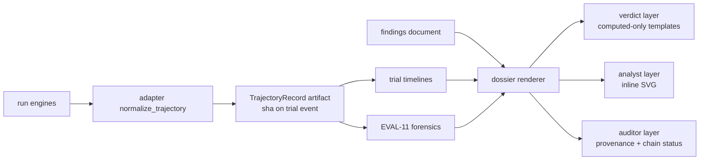

---
# MACHINE CONTRACT — see template header for consumers and YAML style rules.
# STATUS: PROPOSED (2026-07-04). Lives under specs/proposed/ so the AC-coverage
# hook does not enforce it before build; graduates to specs/ in the same commit
# as the story's first AC tests, once its open decisions resolve.
kind: "story"
ticket: "EVAL-12"   # synthetic key — source: 2026-07-04 observability directive (session)
parent: "EVAL-1"
title: "Trajectory capture + comparison dossier: rich telemetry and audience-tiered A/B legibility"
services: []
home: null          # inherited from EVAL-1 (verdi-bench)
inherited_decisions:
  - "EVAL-1-D001"   # instrument residence + name (RESOLVED: verdi-bench)
touchpoints:        # PLANNED symbols [judgment]
  - "harness/run/trajectory.py:TrajectoryRecord"
  - "harness/adapters/base.py:normalize_trajectory"
  - "harness/analyze/dossier.py:render_dossier"
  - "harness/analyze/timeline.py:trial_timeline"

graph_provenance: []

acceptance:
  - id: "AC-1"
    text: "TrajectoryRecord is a versioned contract capturing the ordered steps of a trial — {relative_ts, kind: tool_call|file_edit|test_run|message, tokens, cost, files_touched, exit_code} — normalized across adapters; fields an adapter cannot measure are null, never estimated; the record is stored as a per-trial artifact and its content sha ledgered as an additive field on the trial event."
    vc: "Adapter fixtures for both platforms normalize to the same schema; unmeasured fields are null; the trial event carries trajectory_sha matching the artifact bytes; schema version stamped in the record."
    touchpoints:
      - "harness/run/trajectory.py:TrajectoryRecord"
      - "harness/adapters/base.py:normalize_trajectory"
    tests:
      - "test_ac1_normalized_versioned_record"
      - "test_ac1_sha_ledgered_additive"
  - id: "AC-2"
    text: "Capture is post-redaction and fail-loud: trajectory content passes the EVAL-4 secret/identity scrub before persisting; a corrupt or unwritable trajectory fails the trial closed (the telemetry_corrupt precedent), and an engine that cannot produce a trajectory records an honest absent state — never an empty fabricated record."
    vc: "Redaction canaries planted in step content never reach the persisted record (property test); a corrupt record yields trial_infra_failed(trajectory_corrupt); the fake engine's absent-trajectory path is distinguishable from an empty trajectory."
    touchpoints:
      - "harness/run/trajectory.py:TrajectoryRecord"
    tests:
      - "test_ac2_capture_post_redaction"
      - "test_ac2_corrupt_fails_closed"
  - id: "AC-3"
    text: "The comparison dossier is a single self-contained HTML artifact: no network references, no external assets, byte-identical for a fixed (ledger, seed) — charts are inline SVG generated at render time from findings fields."
    vc: "A property test greps the artifact for external URI schemes and finds none; two renders of the same ledger are byte-identical; the artifact opens with no runtime dependencies."
    touchpoints:
      - "harness/analyze/dossier.py:render_dossier"
    tests:
      - "test_ac3_self_contained_deterministic"
  - id: "AC-4"
    text: "Fence parity: an official dossier passes exactly the official fence the markdown render passes (calibration, corpus identity, rubric hash, selfcheck, contamination asymmetry once EVAL-10 lands); an exploratory dossier carries the EXPLORATORY watermark on every layer and section; ADVISORY grade-tier banners and all disclosure blocks carry over into every layer."
    vc: "A fence-refusing ledger refuses the official dossier with the same cant_analyze reason as markdown; the exploratory dossier fixture shows the watermark in all three layers; an ADVISORY ledger banners in the dossier."
    touchpoints:
      - "harness/analyze/dossier.py:render_dossier"
    tests:
      - "test_ac4_fence_parity"
      - "test_ac4_watermark_every_layer"
  - id: "AC-5"
    text: "The verdict layer (wide audience) is template-generated exclusively from [computed] findings fields: the pre-registered question, the decision rule verbatim, the outcome in plain language, and the uncertainty (CI, MDE, N) always present; the honest-null phrasing rules apply — no sentence exists that does not map to a findings field."
    vc: "A template-inventory test enumerates every verdict-layer sentence template and asserts each interpolates only findings fields; an underpowered fixture renders the MDE caveat; a null result renders the pre-registered null phrasing, never 'no difference'."
    touchpoints:
      - "harness/analyze/dossier.py:render_dossier"
    tests:
      - "test_ac5_verdict_layer_computed_only"
      - "test_ac5_uncertainty_always_present"
  - id: "AC-6"
    text: "The analyst and auditor layers render per-task paired deltas side-by-side (A vs B), per-trial trajectory timelines, judge calibration, forensic flags (once EVAL-11 lands), confounds, and the provenance block (ledger head, chain-verify status, instrument version); missing telemetry renders as 'not measured', never as zero."
    vc: "Timeline fixtures render both arms' trials for a task in one view; a null-telemetry trial shows 'not measured'; the auditor layer's chain status matches verify_chain's verdict."
    touchpoints:
      - "harness/analyze/timeline.py:trial_timeline"
    tests:
      - "test_ac6_side_by_side_timelines"
      - "test_ac6_null_never_zero"
  - id: "AC-7"
    text: "The dossier rides bench analyze as an additional artifact of the same invocation — same findings_rendered event, no new verb — and the README consistency test covers the flag surface."
    vc: "bench analyze --exploratory writes the dossier beside the markdown with exactly one findings_rendered event; the README documents the artifact; the one-event property sweep is unchanged."
    touchpoints:
      - "harness/analyze/dossier.py:render_dossier"
    tests:
      - "test_ac7_rides_analyze_one_event"

constraints:
  - text: "The dossier contains no network references and no external assets — it must be archivable and reviewable air-gapped, and must not leak canaries or task content to a scrapeable surface."
    enforced_by: "test:test_ac3_self_contained_deterministic"
  - text: "No LLM-generated narrative in the dossier (v1): every plain-language sentence is template-derived from [computed] fields — a [judgment] generator inside an official artifact would launder judgment into computed claims."
    enforced_by: "test:test_ac5_verdict_layer_computed_only"
  - text: "The trajectory_sha trial-event field is additive, following the task_commitment/rubric_sha256 precedent; absent field = pre-EVAL-12 trial, and no reader may require it."
    enforced_by: "test:test_ac1_sha_ledgered_additive"
  - text: "Unmeasurable telemetry is null end-to-end: capture, record, and every dossier layer render it as 'not measured' [EVAL-4-D004 inherited]."
    enforced_by: "test:test_ac6_null_never_zero"

decisions:
  - "EVAL-12-D001"  # trajectory_sha additive contract change (OPEN — ContractChange)
  - "EVAL-12-D002"  # dossier rendering technology (OPEN)
  - "EVAL-12-D003"  # LLM narrative exclusion (OPEN)
  - "EVAL-12-D004"  # verb surface (OPEN)
open_decisions:
  - "EVAL-12-D001"
  - "EVAL-12-D002"
  - "EVAL-12-D003"
  - "EVAL-12-D004"

policy_proposals: []
predicted_reach: null
expected_verify: "n/a for groundwork; mechanical gate analog: AC suite green including fence parity, byte-identical dossier, and the template-inventory test."
---

# EVAL-12 — Trajectory capture + comparison dossier

## Problem & context

The instrument's statistical core is world-class; its outputs are
markdown for people who already speak bootstrap. Two audiences are
unserved: engineers who want to see *what the agent actually did*
(rich trajectories, timelines), and decision-makers who need to assess
two contenders without reading a CI table. Meanwhile EVAL-11's forensics
has nothing structured to read — trajectory capture is the missing
substrate for both (2026-07-04 observability directive).

## Goal

One versioned trajectory record per trial, captured at the run seam with
the same honesty rules as all telemetry; and one self-contained
comparison dossier per experiment that lets a wide audience answer "A or
B, how sure, at what cost" in the first screen — without ever saying
more than the findings compute.

## Residence & runtime

Inherited from EVAL-1. Slice A (capture) owns
`harness/run/trajectory.py` + adapter normalization and builds first —
EVAL-11 consumes it. Slice B (dossier) owns `harness/analyze/dossier.py`
and builds after EVAL-11 so forensic flags render in it. The dossier is
a sibling renderer to the existing markdown/HTML renders behind the same
fence.

## Design

**Capture** [AC-1, AC-2, D001]. The TrajectoryRecord is a versioned
contract (public seam — the additive `trajectory_sha` on the trial event
is this story's only hash-chained format change, following the
task_commitment precedent and requiring explicit approval, D001).
Normalization lives in the adapters — each platform maps its native log
to the shared step schema, and what it cannot measure is null (§7.8).
Capture is downstream of redaction: a trajectory is a transcript, and
transcripts leak secrets.

**Dossier** [AC-3–AC-7]. Three layers, one artifact:

- *Verdict* (wide audience): the pre-registered question, the decision
  rule verbatim, the plain-language outcome, and the uncertainty — every
  sentence template-generated from [computed] fields [AC-5]. Legibility
  must not become overclaiming: the layer can only say what the findings
  already say, phrased for humans.
- *Analyst*: paired per-task deltas side-by-side, secondary metrics,
  judge calibration, forensic flags, confounds — inline SVG, no external
  charting [AC-6].
- *Auditor*: provenance, ledger head, chain-verify status, per-trial
  timelines — the layer that makes "verify it yourself" a link, not a
  ritual.

Self-containment [AC-3] is a determinism *and* a leakage property: no
network means archivable, reproducible, and no canary/task content on a
scrapeable CDN. Fence parity [AC-4] means legibility never becomes a
side door around the official gate — the prettiest render obeys the same
rules as the plainest.

## Change surface

> Provenance: [judgment] hand-authored — greenfield.

## Acceptance criteria mapping

AC-1 makes trajectories a contract, not a log dump. AC-2 keeps capture
inside the redaction and fail-loud perimeter. AC-3 makes the dossier
archivable and deterministic. AC-4 keeps every layer inside the fence
and under the watermark. AC-5 is the legibility-without-overclaiming
guarantee. AC-6 serves the analyst and auditor audiences with honest
nulls. AC-7 keeps the verb surface flat and mechanically documented.

## Expected post-state

A fake-engine fixture experiment renders a dossier whose verdict layer
states the decision-rule outcome with CI and MDE, whose analyst layer
shows five tasks' paired deltas and both arms' timelines, and whose
auditor layer shows a green chain status — byte-identical across two
renders, refused as official exactly when markdown is.

## Out of scope

Live/streaming dashboards and servers; LLM-written executive summaries
(v1 constraint; revisit only as an EXPLORATORY-tagged layer, D003);
cross-experiment dossiers (v2, with meta-analysis); dossier theming and
branding; PDF export.

## Open questions

- EVAL-12-D001 — additive trajectory_sha on the trial event
  (ContractChange; recommended: approve, task_commitment precedent).
- EVAL-12-D002 — rendering technology (recommended: jinja2 templates +
  inline SVG, minimal inline JS for collapse/toggle only, zero external
  dependencies).
- EVAL-12-D003 — LLM narrative (recommended: excluded from v1 by
  constraint).
- EVAL-12-D004 — verb surface (recommended: an artifact of bench
  analyze, no new verb).
