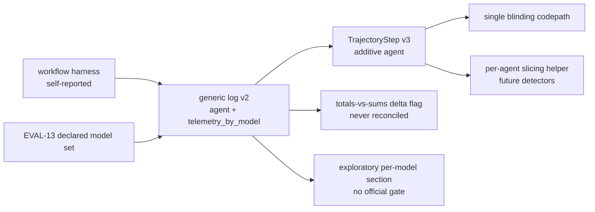

---
# MACHINE CONTRACT — see template header for consumers and YAML style rules.
# PROPOSED — graduates to specs/ in the same commit as the story's first AC
# tests, once EVAL-13 has landed and the open decisions below are resolved by
# a human. Build order is explicitly gated (D004): this story depends on the
# declared model set EVAL-13 introduces.
kind: "story"
ticket: "EVAL-14"   # synthetic key — source: 2026-07-04 multi-model workflow directive (session)
parent: "EVAL-1"
title: "Per-agent trajectory attribution + per-model telemetry: exploratory observability inside multi-agent arms"
services: []
home: null          # inherited from EVAL-1 (verdi-bench)
inherited_decisions:
  - "EVAL-1-D001"   # instrument residence + name (RESOLVED: verdi-bench)
  - "EVAL-4-D004"   # nulls flagged, never imputed
  - "EVAL-12-D001"  # trajectory_sha additive contract precedent
touchpoints:        # PLANNED symbols [judgment]
  - "harness/run/trajectory.py:TrajectoryStep"
  - "harness/adapters/generic.py:normalize_generic"
  - "harness/adapters/generic.py:normalize_generic_trajectory"
  - "harness/analyze/report.py:telemetry_means"

graph_provenance: []

acceptance:
  - id: "AC-1"
    text: "TrajectoryStep gains an additive optional 'agent' field (schema v3): a free-text label attributing the step to a sub-agent of the workflow. Null means unattributed — the honest state for single-agent platforms and v2 records, which read back with null agent throughout (the v1→v2 'command' precedent); no reader may require the field."
    vc: "A v2 trajectory artifact reads back with null agent on every step; a v3 record round-trips its labels; every existing trajectory consumer runs unchanged on both."
    touchpoints:
      - "harness/run/trajectory.py:TrajectoryStep"
    tests:
      - "test_ac1_agent_field_additive_v3"
      - "test_ac1_v2_reads_back_null_agent"
  - id: "AC-2"
    text: "Generic normalized log v2: verdi_log_version 2 accepts 'agent' on trajectory steps and a 'telemetry_by_model' object keyed by declared model ids (EVAL-13's primary + aux set), each value validating through the Telemetry model with the usual null honesty. A v1 log parses exactly as before; a v2 log keyed by an undeclared model id fails loudly (the declared-format strictness rule) — attribution to a model the spec never registered is a contradiction, not data."
    vc: "A v1 fixture log parses unchanged; a v2 log with declared keys yields per-model Telemetry blocks; an undeclared key raises GenericLogError naming it; per-model nulls land as nulls."
    touchpoints:
      - "harness/adapters/generic.py:normalize_generic"
      - "harness/adapters/generic.py:normalize_generic_trajectory"
    tests:
      - "test_ac2_log_v2_by_model_declared_keys"
      - "test_ac2_undeclared_model_key_fails_loud"
      - "test_ac2_v1_logs_parse_unchanged"
  - id: "AC-3"
    text: "Identity honesty by construction: agent attribution uses a closed role vocabulary published as part of the format standard — a label matches role(-ordinal)? where role is a closed enum (planner, executor, orchestrator, router, critic, reviewer, tester, researcher, worker) and ordinal is a small integer for multiple instances (worker-1, worker-2). Validated loudly at the generic-adapter parse: a non-conforming label ('llama-planner', free text) raises GenericLogError naming it. The value space cannot spell a model, vendor, platform, or arm identity, so no published surface needs a new scrub and the blind subsystem is untouched; extending the vocabulary is a format-version bump (the forensics detector-vocabulary precedent — a closed-enum test forces the bump)."
    vc: "Every conforming label parses and round-trips; 'llama-planner' and free-text labels are refused at parse naming the label; the blind subsystem diff is empty; the vocabulary closed-enum test forces a version bump on extension."
    touchpoints:
      - "harness/adapters/generic.py:normalize_generic_trajectory"
    tests:
      - "test_ac3_closed_role_vocabulary"
      - "test_ac3_nonconforming_label_refused"
  - id: "AC-4"
    text: "Aggregation honesty: whole-trial telemetry remains the sole authoritative stream — the primary metric, cost guard, and cross-arm comparisons never read telemetry_by_model. When both exist and the by-model blocks sum measurably different from the whole-trial totals, the delta is surfaced as a flag on the record (the proxy_cost_delta precedent) — never reconciled, never imputed in either direction."
    vc: "A log whose by-model costs sum below its total cost yields a by_model_delta flag and untouched totals; the cost guard's enforcement value is identical with and without the by-model block; no analysis gate reads by-model fields."
    touchpoints:
      - "harness/adapters/generic.py:normalize_generic"
    tests:
      - "test_ac4_by_model_delta_surfaced_never_reconciled"
      - "test_ac4_authoritative_stream_unchanged"
  - id: "AC-5"
    text: "The consumer (exploratory analysis): the report renders a per-model telemetry section — clearly EXPLORATORY, applying vendor-incomparability per model id — and a per-agent step-count/timeline slice of the trajectory; absent attribution renders 'not attributed', never zero and never redistributed."
    vc: "A fixture with by-model blocks renders the section with per-model vendor rules applied; a trial without attribution renders 'not attributed'; the section carries the exploratory marking and feeds no official gate."
    touchpoints:
      - "harness/analyze/report.py:telemetry_means"
    tests:
      - "test_ac5_per_model_section_exploratory"
      - "test_ac5_unattributed_never_zero"
  - id: "AC-6"
    text: "Forensics substrate: a per-agent slicing helper over verified trajectories (resolve → group steps by agent) is available to detectors; v1 detectors are unchanged — the helper ships with fixture coverage so a future per-agent detector starts from tested ground, not a new parser."
    vc: "The helper groups a v3 fixture's steps by agent with null-agent steps in an explicit unattributed bucket; the detector vocabulary and existing findings are byte-identical before/after."
    touchpoints:
      - "harness/run/trajectory.py:TrajectoryStep"
    tests:
      - "test_ac6_per_agent_slicing_helper"

constraints:
  - text: "Depends on EVAL-13: the declared model set is the validation universe for telemetry_by_model keys. This story must not land first — without declaration, by-model attribution would be unverifiable free text feeding analysis."
    enforced_by: "test:test_ac2_undeclared_model_key_fails_loud"
  - text: "Self-reported attribution is untrusted by construction: it may enrich exploratory analysis and future forensics, and must never feed the primary metric, the decision rule, the cost guard, or any official fence. The instrument cannot verify what happened inside the hermetic container; attribution is the arm's testimony, labeled as such."
    enforced_by: "test:test_ac4_authoritative_stream_unchanged"
  - text: "Both format changes are versioned-contract changes (TrajectoryStep v3, generic log v2) requiring explicit human approval with the additive/compatibility posture recorded in the decisions below — older records and logs parse unchanged forever."
    enforced_by: "test:test_ac1_v2_reads_back_null_agent"
  - text: "The blind subsystem is untouched (2026-07-04 constraint): agent identity leakage is unrepresentable by vocabulary construction, not scrubbed after the fact — no new patterns, no new scrub mechanism, no blinding-wrapper mapping."
    enforced_by: "test:test_ac3_nonconforming_label_refused"

decisions:
  - "EVAL-14-D001"  # ContractChange: TrajectoryStep v3 'agent' field (OPEN)
  - "EVAL-14-D002"  # ContractChange: generic log format v2 (OPEN)
  - "EVAL-14-D003"  # agent label handling posture (OPEN)
  - "EVAL-14-D004"  # build gating on EVAL-13 + named consumer (OPEN)
open_decisions:
  - "EVAL-14-D001"
  - "EVAL-14-D002"
  - "EVAL-14-D003"
  - "EVAL-14-D004"

policy_proposals: []
predicted_reach: null
expected_verify: "AC suite green: v2→v3 read-back compatibility, v1 log parity, declared-key strictness, delta-surfaced-never-reconciled, exploratory-only consumption, per-agent slicing fixtures."
---

# EVAL-14 — Per-agent trajectory attribution + per-model telemetry

## Problem & context

EVAL-13 makes a multi-model workflow *declarable*; this story makes it
*observable*. A workflow arm today reports whole-trial aggregates and a
flat step timeline — correct, but blind to the questions a workflow
comparison eventually asks: which sub-agent spent the budget, which
model did the edits, did the router earn its overhead. The instrument's
answer must stay inside its trust model: everything attributed inside
the container is the arm's own testimony, unverifiable by construction
(2026-07-04 multi-model workflow directive).

## Goal

Attribution as exploratory, versioned, honestly-null data: an `agent`
label per trajectory step (schema v3) and a `telemetry_by_model` block
in the generic log (format v2), keyed strictly by EVAL-13's declared
model set, consumed only by exploratory analysis and available as a
tested substrate for future forensics — with the authoritative
whole-trial stream and every official gate untouched.

## Residence & runtime

Inherited from EVAL-1. Gated behind EVAL-13 (D004): the declared model
set is what makes by-model keys validatable. Build order inside the
story: schema v3 → log format v2 → blinding coverage → the analysis
consumer → the forensics helper. The consumer [AC-5] ships in the same
story deliberately — attribution surface without a consumer would be
speculative machinery, which the project's own discipline forbids.

## Design

**Trust class first.** The container is hermetic; the instrument sees
its boundary (proxy egress, workspace bytes) and nothing inside.
Per-agent and per-model splits therefore can never be measurements —
they are self-reports, useful the way self-reported cost is useful:
cross-checkable at the boundary (totals vs. sums, AC-4), surfaced with
deltas, never reconciled, and never load-bearing for a verdict. Every
design choice below follows from fixing this trust class explicitly.

**Schema v3** [AC-1, D001]. One additive optional field, following the
v1→v2 `command` precedent exactly: older records read back null, no
reader requires it, version stamped.

**Log format v2** [AC-2, D002]. The generic format keeps its
declaration-splits-honesty rule: undeclared logs stay honest-null,
declared logs are strict. Keying `telemetry_by_model` to the EVAL-13
declared set extends that rule — attributing spend to a model the
locked spec never registered is a contradiction the parser refuses,
not data it stores.

**Identity by vocabulary, not scrubbing** [AC-3, D003]. Agent labels
are the one genuinely new identity surface, and free-text labels have a
demonstrated leak: arm canaries are exact-match full-id literals, so a
model-name *fragment* ("llama-planner") matches neither the built-in
patterns (no llama/qwen/deepseek/mistral entries) nor the literals, and
walks onto human-review and dossier surfaces. Per the 2026-07-04
constraint (do not touch the blind subsystem), the resolution path is a
*published standard*: a closed role vocabulary with ordinal instances,
validated loudly where the format's other strictness rules already live
(the generic-adapter parse). Leakage becomes unrepresentable instead of
scrubbed — the same construction-over-inspection move as the
holdout-free TrialRequest signature. Inference at intake was considered
and rejected: the instrument cannot infer agent identity from log
structure without the harness supplying it (circular), and labeling by
inference is estimation — the same reason the claude_code adapter
refuses to infer test_run from command text. Honest costs: bounded
expressiveness (worker-N is the catch-all; the vocabulary extends only
with a format-version bump), and step-structure remains a mild
stylistic tell (a reviewer can see a fleet's size and shape — the same
class of tell as transcript style, tolerable on advisory surfaces).

**Consumer + substrate** [AC-5, AC-6]. The exploratory report section
is the story's own consumer, applying per-model vendor-incomparability
so the honesty rules deepen with the data rather than diluting. The
forensics helper is substrate only: detectors change in a future story,
when a per-agent detector has planted-violation fixtures of its own.

## Change surface

> Provenance: [judgment] hand-authored — greenfield.

## Acceptance criteria mapping

AC-1/AC-2 are the two versioned-contract changes with their
compatibility postures. AC-3 keeps the new identity surface inside the
one blind firewall. AC-4 pins the trust class mechanically. AC-5 ships
the consumer that justifies the surface. AC-6 lays tested ground for
future per-agent forensics without touching v1 detectors.

## Expected post-state

A fixture workflow arm emits a v2 log attributing steps to 'planner'
and 'executor' and splitting telemetry across its two declared models;
the trial record carries identical authoritative totals plus a by-model
delta flag; the exploratory report renders the per-model section with
vendor rules applied and 'not attributed' where data is absent; a v2-era
trajectory from an earlier experiment reads back untouched with null
agents.

## Out of scope

Per-agent or per-model anything in the primary metric, decision rule,
cost guard, or official fence; verifying attribution beyond the
boundary cross-checks; multi-container orchestration; per-agent
quotas/timeouts; new forensic detectors (future story, with their own
planted-violation fixtures); attribution for the native claude_code /
codex adapters (their logs carry no such structure to parse honestly).

## Open questions

- EVAL-14-D001 — TrajectoryStep v3 additive `agent` field
  (ContractChange; recommended: approve, `command` precedent).
- EVAL-14-D002 — generic log format v2 (ContractChange; recommended:
  approve with v1-parses-forever compatibility).
- EVAL-14-D003 — agent label posture (recommended:
  closed-role-vocabulary, added after the 2026-07-04 constraint ruled
  out blind-subsystem changes — leakage unrepresentable by
  construction, validated at the parse layer that already owns the
  format's strictness; the earlier four options remain recorded, each
  failing the constraint or the leak test).
- EVAL-14-D004 — build gating (recommended: gate on EVAL-13 landing;
  AC-5's exploratory section is the named consumer that unblocks
  building).
